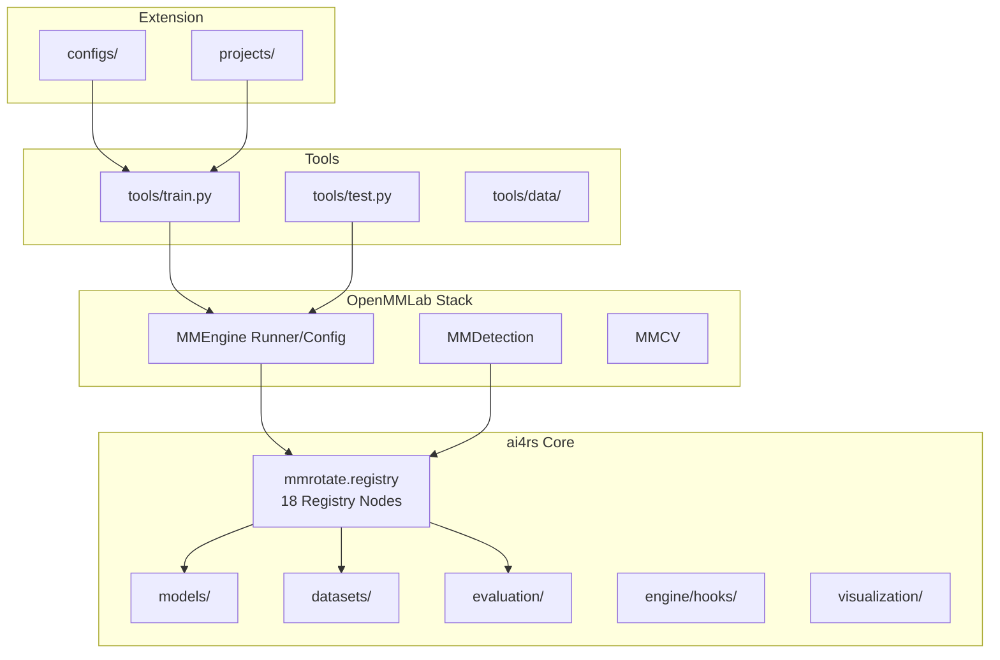

# ai4rs 仓库结构分析报告

> 生成日期：2026-06-09  
> 分析对象：`/data/users/litianhao01/PairMmot/ai4rs`

---

## 1. 项目概览

**ai4rs**（AI for Remote Sensing）是基于 **OpenMMLab** 生态构建的遥感深度学习工具箱，核心继承自 [MMRotate](https://github.com/open-mmlab/mmrotate) 1.x，并在此基础上集成大量遥感方向的前沿算法与数据集支持。

| 属性 | 说明 |
|------|------|
| 包名 | `mmrotate`（沿用 MMRotate 命名） |
| 版本 | `1.0.0rc1` |
| 许可证 | Apache 2.0 |
| Python | 3.10（推荐） |
| 深度学习框架 | PyTorch 2.x |
| 上游依赖 | MMEngine、MMCV 2.2.0、MMDetection 3.x、MMSegmentation |
| 代码规模 | ~985 个 `.py` 文件，~1242 个总文件 |
| 远程仓库 | https://github.com/wokaikaixinxin/ai4rs |

**定位**：将遥感相关任务（旋转目标检测、SAR、变化检测、分割、SAM 等）统一到一个可配置、可扩展的 MMLab 框架下。

---

## 2. 顶层目录结构

```
ai4rs/
├── mmrotate/          # 核心 Python 包（142 文件）
├── configs/           # 内置算法配置（202 文件，23 个算法族）
├── projects/          # 社区/论文复现项目（740 文件，47 个子项目）
├── tools/             # 训练/测试/数据/部署脚本（70 文件）
├── tests/             # 单元测试（47 文件）
├── demo/              # 演示脚本
├── docker/            # Docker 部署
├── requirements/      # 分层依赖声明
├── setup.py           # 安装入口
├── model-index.yml    # 模型索引（MIM 生态）
└── README.md
```

### 各目录体量

| 目录 | 文件数 | Python 文件数 | 职责 |
|------|--------|---------------|------|
| `projects/` | 740 | ~612 | 论文算法、扩展模块 |
| `configs/` | 202 | ~156 | 标准算法训练配置 |
| `mmrotate/` | 142 | ~120 | 核心库实现 |
| `tools/` | 70 | ~30 | CLI 工具与数据预处理 |
| `tests/` | 47 | ~40 | 单元测试 |
| `demo/` | 6 | — | 演示 |
| `docker/` | 4 | — | 容器化部署 |

---

## 3. 架构设计

### 3.1 注册表驱动（Registry Pattern）

与 MMEngine/MMDet 一致，通过 `mmrotate/registry.py` 定义 **18 个注册节点**，所有模块通过 `@MODELS.register_module()` 等方式注册，由配置文件动态构建。



启动时 `register_all_modules()`（位于 `mmrotate/utils/setup_env.py`）会导入 `datasets`、`evaluation`、`models`、`visualization` 四个子包，完成模块注册并设置 `DefaultScope` 为 `mmrotate`。

### 3.2 版本依赖约束

`mmrotate/__init__.py` 中声明的兼容范围：

| 依赖 | 最低版本 | 最高版本 |
|------|----------|----------|
| MMCV | 2.0.0rc4 | 2.2.0 |
| MMEngine | 0.6.0 | 1.0.0 |
| MMDetection | 3.0.0rc6 | 3.4.0 |

> **注意**：README 建议安装 MMCV 2.2.0 后，手动放宽 mmdet/mmseg 源码中的版本上限检查。

---

## 4. 核心包 `mmrotate/`

### 4.1 模块树

```
mmrotate/
├── apis/              # 高层 API 接口
├── datasets/          # 数据集定义 + transforms
│   └── transforms/    # 数据增强/预处理
├── engine/
│   └── hooks/         # 训练钩子（checkpoint、可视化等）
├── evaluation/
│   ├── functional/    # 评估函数
│   └── metrics/       # DOTA/COCO/FAIR 等指标
├── models/
│   ├── backbones/     # ReResNet、YOLO backbone 等
│   ├── dense_heads/   # 15 种检测头
│   ├── detectors/     # 检测器
│   ├── losses/        # GWD/KLD/KFIoU 等旋转框损失
│   ├── necks/         # FPN 变体
│   ├── roi_heads/     # 两阶段 ROI 头
│   ├── task_modules/  # assigner / coder / anchor generator
│   ├── layers/        # 自定义层
│   └── data_preprocessors/
├── structures/
│   └── bbox/          # RotatedBoxes、QuadriBoxes 等
├── visualization/     # 本地可视化器
├── utils/               # 环境设置、patch 工具
├── registry.py
└── version.py
```

### 4.2 内置检测器（`models/detectors/`）

| 文件 | 用途 |
|------|------|
| `h2rbox.py` / `h2rbox_v2.py` | 弱监督旋转检测 |
| `refine_single_stage.py` | 单阶段 refine 架构（R³Det、S²A-Net 等） |
| `dual_input_encoder_decoder.py` | 双时相变化检测 |
| `siamencoder_decoder.py` | Siamese 变化检测 |
| `yolo_detector.py` | YOLO 系列检测 |

### 4.3 内置数据集（`datasets/`）

覆盖 15+ 遥感数据集：

| 数据集 | 文件 | 任务 |
|--------|------|------|
| DOTA | `dota.py` | 旋转检测 |
| DIOR | `dior.py` | 旋转检测 |
| HRSC | `hrsc.py` | 舰船检测 |
| FAIR1M | `fair.py` | 旋转检测 |
| STAR | `star.py` | 场景图生成 |
| ReCon1M | `recon1m.py` | 场景图生成 |
| LEVIR-CD | `levir_cd.py` | 变化检测 |
| DroneVehicle | `dronevehicle.py` | RGB-红外 |
| SARDet-100K | `sardet_100k.py` | SAR 检测 |
| RSAR | `rsar.py` | SAR 检测 |
| NWPU | `nwpu.py` | 目标检测 |
| KFGOD | `kfgod.py` | 旋转检测 |
| ICDAR2015 | `icdar2015.py` | 文本检测 |

### 4.4 评估指标（`evaluation/metrics/`）

- `dota_metric.py` — DOTA 官方评估
- `rotated_coco_metric.py` — COCO 格式旋转框评估
- `fair_metric.py` — FAIR1M 评估
- `icdar2015_metric.py` — ICDAR2015 评估
- `coco_metric_sardet_100k.py` — SARDet-100K 评估

---

## 5. 配置系统 `configs/`

23 个算法族，每个目录含 `.py` 配置、`README.md`、`metafile.yml`：

| 类别 | 算法目录 |
|------|----------|
| 两阶段 | `rotated_faster_rcnn`、`roi_trans`、`oriented_rcnn`、`gliding_vertex` |
| 单阶段 | `rotated_retinanet`、`rotated_fcos`、`rotated_atss`、`r3det`、`s2anet` |
| 实时 | `rotated_rtmdet` |
| 损失函数 | `gwd`、`kld`、`kfiou` |
| 角度编码 | `csl`、`psc` |
| 弱监督 | `h2rbox`、`h2rbox_v2` |
| RepPoints 系列 | `rotated_reppoints`、`oriented_reppoints`、`sasm_reppoints` |
| 其他 | `cfa`、`redet`、`convnext` |

配置继承 `_base_/` 下的通用设置（模型、数据集、训练 schedule、runtime）。

---

## 6. 项目扩展 `projects/`

47 个子项目，占 Python 代码量约 **62%**（612/985）。采用 OpenMMLab 社区项目规范：

```
projects/<ProjectName>/
├── README.md           # 算法说明、训练/测试命令、结果
├── configs/            # 项目专属配置
└── <package>/          # 自定义模块（detector/head/backbone 等）
    └── __init__.py
```

### 6.1 完整子项目列表

```
ABBSPO          ACM             AMMBA           ARC
bit             CATNet          changer         easydeploy
example_project FAA             fcsn            GauCho
GRA             grounded_sam    GSDet_baseline  HERO
icdar2015_evaluation  idasiamnet  LabelStudio   LEGNet
LSKNet          LWGANet         mask_rcnn       MessDet
mmrotate-sam    OrientedFormer  PKINet          Point2Rbox
Point2Rbox_v2   RHINO           rotated_deformable_detr
rotated_DiffusionDet  rotated_dino  rotated_rtdetr  rotated_yoloms
rotated_yolox   RR360           rtdetr          sam2
sam2_1_ai4rs    sam2_ai4rs      sam3            SARDet_100K
SegEarth_OV_3   segment_anything  Strip_RCNN      WhollyWOOD
```

### 6.2 按任务分类

| 任务方向 | 代表项目 |
|----------|----------|
| 旋转检测（新架构） | GSDet_baseline、OrientedFormer、MessDet、HERO、O2-RTDETR |
| 实时检测 | rotated_yolox、rotated_yoloms、rtdetr |
| Transformer | rotated_dino、rotated_deformable_detr、RHINO |
| Backbone | LSKNet、PKINet、GRA、LEGNet、Strip_RCNN、LWGANet、FAA |
| 弱监督 | Point2Rbox、Point2Rbox_v2、WhollyWOOD、ABBSPO |
| 变化检测 | fcsn、changer、bit、idasiamnet |
| SAR | SARDet_100K |
| 分割 / SAM | segment_anything、sam2、sam3、SegEarth_OV_3、grounded_sam |
| 实例分割 | mask_rcnn、CATNet |
| 编码 / 损失 | ACM、GauCho |

### 6.3 扩展示例：GSDet_baseline

```
projects/GSDet_baseline/
├── README_GSDet_baseline.md
├── README_ReDiffDet_baseline.md
├── configs/
└── gsdet/
    ├── gsdet.py              # 主检测器
    ├── decoder.py
    ├── topk_hungarian_assigner.py
    ├── match_cost.py
    ├── box_converters.py
    └── ...
```

通过 config 中的 `custom_imports` 引入自定义模块，无需修改核心库。

---

## 7. 工具链 `tools/`

```
tools/
├── train.py              # 单卡/多卡训练入口
├── test.py               # 评估入口
├── dist_train.sh         # 分布式训练
├── dist_test.sh          # 分布式测试
├── slurm_train.sh        # Slurm 集群训练
├── slurm_test.sh         # Slurm 集群测试
├── data/                 # 17 个数据集预处理脚本
│   ├── dota/             # 切片、COCO 转换
│   ├── fair/、star/、recon1m/  # 大图切片
│   └── README.md         # 数据目录规范
├── analysis_tools/       # benchmark、FLOPs、混淆矩阵、日志分析
├── deployment/           # TorchServe 部署
└── model_converters/     # 模型发布转换
```

### 标准工作流

```bash
# 单卡训练
python tools/train.py <config_path>

# 多卡训练
bash tools/dist_train.sh <config_path> <num_gpus>

# 单卡测试
python tools/test.py <config_path> <checkpoint_path>

# 多卡测试
bash tools/dist_test.sh <config_path> <checkpoint_path> <num_gpus>
```

Config 路径可指向 `configs/` 或 `projects/*/configs/`。

---

## 8. 测试体系 `tests/`

```
tests/
├── test_apis/
├── test_structures/test_bbox/     # RotatedBoxes、QuadriBoxes
├── test_models/
│   ├── test_backbones/
│   ├── test_dense_heads/
│   ├── test_detectors/
│   ├── test_losses/
│   ├── test_necks/
│   ├── test_roi_heads/
│   └── test_task_modules/         # assigner、coder、anchor
├── test_datasets/test_transforms/
├── test_evaluation/test_metrics/
└── test_visualization/
```

共 ~47 个测试文件，以 MMRotate 核心功能为主，`projects/` 扩展模块测试覆盖较少。

---

## 9. 依赖与安装

### 9.1 依赖文件

```
requirements/
├── runtime.txt       # 核心：torch, numpy, matplotlib, pycocotools
├── optional.txt      # 可选功能
├── multimodal.txt    # 多模态
├── tests.txt         # 测试依赖
├── build.txt         # 构建
├── docs.txt          # 文档构建
├── readthedocs.txt   # ReadTheDocs
└── mminstall.txt     # MIM 安装
```

### 9.2 安装方式

```bash
# 基础安装
pip install -v -e .

# 全功能安装（推荐，含变化检测等）
pip install -v -e .[all]
```

`setup.py` 通过 `add_mim_extension()` 将 `tools/`、`configs/`、`demo/` 软链接到 `mmrotate/.mim/`，支持 MIM 包管理器。

### 9.3 推荐环境

```bash
conda create --name ai4rs python=3.10 -y
conda activate ai4rs
pip install torch==2.4.0 torchvision==0.19.0 torchaudio==2.4.0 --index-url https://download.pytorch.org/whl/cu121
pip install -U openmim
mim install mmengine
mim install "mmcv==2.2.0"
mim install 'mmdet>3.0.0rc6, <3.4.0'
mim install "mmsegmentation>=1.2.2"
pip install -v -e .[all]
```

---

## 10. 任务能力矩阵

| 任务 | 规模 | 关键算法 / 数据 |
|------|------|-----------------|
| 旋转目标检测 | 核心，30+ 算法 | Oriented R-CNN、RTMDet、GSDet、HERO |
| 实时检测 | 5+ | YOLOX、YOLOMS、RT-DETR、O2-RTDETR |
| SAR 检测 | 2 | SARDet-100K、RSAR |
| 变化检测 | 6 | FC-Siam、Changer、BiT、IDA-SiamNet |
| 实例 / 语义分割 | 3 | Mask R-CNN、CATNet、SegEarth-OV3 |
| SAM 系列 | 8+ | SAM、SAM2、SAM3、Grounded SAM |
| 弱监督检测 | 5 | H2RBox、Point2Rbox、WhollyWOOD |
| 场景图生成 | 2 | STAR、ReCon1M（数据支持） |
| RGB-红外 | 1 | DroneVehicle |

---

## 11. 数据组织规范

推荐将数据集软链接到 `ai4rs/data/`，`tools/data/README.md` 定义了 17 个数据集的目录结构。

### 支持的数据集

| 数据集 | 预处理目录 | 任务 |
|--------|------------|------|
| DOTA | `tools/data/dota/` | 旋转检测 |
| DIOR | `tools/data/dior/` | 旋转检测 |
| SSDD / SRSDD / RSDD | `tools/data/ssdd/` 等 | SAR 舰船 |
| HRSC / HRSID | `tools/data/hrsc/` 等 | 舰船检测 |
| FAIR1M | `tools/data/fair/` | 旋转检测 |
| SARDet-100K | `tools/data/sardet_100k/` | SAR 检测 |
| RSAR | `tools/data/rsar/` | SAR 检测 |
| STAR | `tools/data/star/` | 场景图 |
| ReCon1M | `tools/data/recon1m/` | 场景图 |
| LEVIR-CD | `tools/data/levir_cd/` | 变化检测 |
| iSAID | `tools/data/isaid/` | 实例分割 |
| DroneVehicle | `tools/data/dronevehicle/` | RGB-红外 |
| NWPU | `tools/data/nwpu/` | 目标检测 |
| CODrone / KFGOD | `tools/data/codrone/` 等 | 旋转检测 |

### 推荐数据目录

```
ai4rs/
└── data/
    ├── split_ss_dota/
    │   ├── trainval/
    │   └── test/
    ├── DIOR/
    │   ├── Annotations/
    │   └── ImageSets/
    └── ...
```

---

## 12. CI / 基础设施

| 路径 | 用途 |
|------|------|
| `.github/workflows/` | GitHub Actions CI |
| `.github/ISSUE_TEMPLATE/` | Issue 模板 |
| `.circleci/` | CircleCI 配置 |
| `docker/serve/` | 模型服务容器 |
| `model-index.yml` | OpenMMLab 模型索引 |

---

## 13. 结构特点总结

### 优势

1. **模块化扩展清晰** — 核心在 `mmrotate/`，新算法放 `projects/`，不污染主干
2. **配置驱动** — 统一 MMEngine Runner，训练 / 测试 / 部署流程一致
3. **算法覆盖广** — 从经典 Rotated RetinaNet 到 2026 年最新论文（HERO、Strip R-CNN、FAA）
4. **数据集生态完整** — 17 个遥感数据集预处理脚本开箱即用
5. **兼容 OpenMMLab** — 可直接复用 MMDet 组件，文档沿用 MMRotate ReadTheDocs

### 需注意

1. 包名仍为 `mmrotate`，与上游 MMRotate 存在命名重叠
2. `projects/` 占代码量 ~62%，质量与维护度因项目而异
3. 文档依赖外部 MMRotate ReadTheDocs，仓库内无 `docs/` 目录
4. MMCV / mmdet / mmseg 版本需手动 patch，安装步骤较繁琐
5. 测试主要覆盖核心库，`projects/` 扩展测试不足

---

## 14. 推荐使用路径

| 场景 | 路径 |
|------|------|
| 使用内置算法 | 直接选 `configs/<algorithm>/` 下的配置训练 |
| 复现论文 | 进入对应 `projects/<name>/`，读 README，用其 configs |
| 开发新算法 | 参考 `projects/example_project/` 模板，在 `projects/` 下新建子项目 |
| 准备数据 | 按 `tools/data/<dataset>/README.md` 预处理，软链接到 `data/` |
| 与 PairMmot 集成 | 将 ai4rs 作为旋转检测 / 遥感预处理子模块，通过 config 调用 `tools/train.py` 或 import `mmrotate` |

---

## 15. 参考链接

- [ai4rs GitHub](https://github.com/wokaikaixinxin/ai4rs)
- [MMRotate 文档（中文）](https://mmrotate.readthedocs.io/zh_CN/1.x/)
- [MMRotate 文档（英文）](https://mmrotate.readthedocs.io/en/1.x/)
- [OpenMMLab 平台](https://platform.openmmlab.com)
