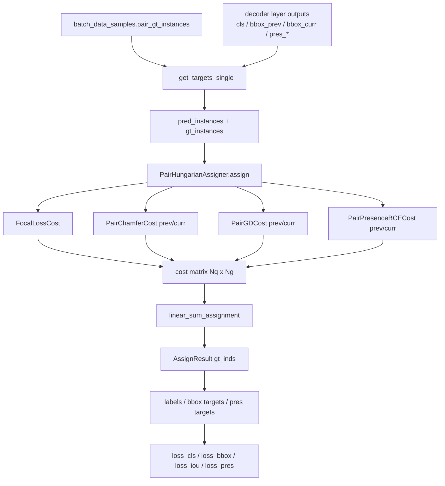

# o2_pair_rtdetr_r18vd_overfit_sameframe：Head Loss 匹配机制报告

> 配置：`configs/o2_pair_rtdetr_r18vd_overfit_sameframe.py`  
> 目标：说明在计算 `PairRotatedRTDETRHead` loss 时，**query 与 GT pair 的匹配在哪里发生、如何完成**。

---

## 1. 总览

该配置使用 **Pair RT-DETR** 架构：50 个 learned queries，每个 query 同时预测 prev/curr 两帧的 OBB 与 presence。训练 loss 采用 DETR 风格的 **匈牙利一对一匹配（Hungarian Matching）**，但匹配对象是 **pair query ↔ pair GT**（同一 track 在 prev/curr 上的联合标注），而非单帧检测框。

匹配发生在 **loss 计算的目标分配阶段**，不在 forward 推理路径中。核心调用链：

```
MultispecPairRotatedRTDETR.loss()
  └─ PairRotatedRTDETRHead.loss()
       └─ loss_by_feat()
            └─ loss_by_feat_single()          # 每个 decoder layer 各做一次
                 └─ get_targets()
                      └─ _get_targets_single() # 每张图各做一次
                           └─ self.assigner.assign()   ← 匹配入口
                                └─ PairHungarianAssigner
                                     └─ linear_sum_assignment(cost)
```

**重要特性：**

| 项目 | 说明 |
|------|------|
| 匹配时机 | 仅训练 loss；推理 `predict()` 不做匈牙利匹配 |
| 匹配粒度 | 每张图、每个 decoder layer **独立**匹配一次 |
| Assigner 类型 | `PairHungarianAssigner`（配置于 `model.train_cfg.assigner`） |
| Query 数 | 50（`num_queries=50`） |
| DN 分支 | `dn_cfg=None`，无 denoising 匹配分支 |
| Encoder aux loss | `loss_by_feat` 中显式丢弃 enc/DN，不参与匹配 |

---

## 2. 配置如何注入 Assigner

在 `o2_pair_rtdetr_r18vd_overfit_sameframe.py` 中：

```python
_pair_assigner = dict(
    type='PairHungarianAssigner',
    match_costs=[
        dict(type='mmdet.FocalLossCost', weight=2.0),
        dict(type='PairChamferCost', side='prev', weight=5.0),
        dict(type='PairChamferCost', side='curr', weight=5.0),
        dict(type='PairGDCost', side='prev', loss_type='kld', fun='log1p', tau=1, sqrt=False, weight=2.0),
        dict(type='PairGDCost', side='curr', loss_type='kld', fun='log1p', tau=1, sqrt=False, weight=2.0),
        dict(type='PairPresenceBCECost', side='prev', weight=1.0),
        dict(type='PairPresenceBCECost', side='curr', weight=1.0),
    ])
model.train_cfg = dict(assigner=_pair_assigner)
model.bbox_head.update(type='PairRotatedRTDETRHead', ...)
```

MMDetection 在构建 detector 时会将 `model.train_cfg` 合并进 `bbox_head`，head 内部持有 `self.assigner`（继承自 `DETRHead` 初始化逻辑）。单元测试中也通过 `train_cfg=_default_train_cfg()` 传入同一 assigner 配置。

与单帧 O2-RTDETR（`HungarianAssigner` + `FocalLossCost` + `ChamferCost` + `GDCost`）相比，pair 版本将 box cost **按 prev/curr 各算一份**，并额外加入 **presence BCE cost**。

---

## 3. 从模型 forward 到匹配的完整路径

### 3.1 模型入口

`MultispecPairRotatedRTDETR.loss()` 提取 backbone/neck 特征，经 transformer decoder 得到 hidden states 与 references，再调用 head loss：

```python
losses = self.bbox_head.loss(
    **head_inputs_dict,
    batch_data_samples=batch_data_samples)
```

### 3.2 Head loss 分层

`PairRotatedRTDETRHead.loss()` → `loss_by_feat()` 对 **所有 decoder layer** 调用 `multi_apply(self.loss_by_feat_single, ...)`。

每一层都会：

1. 调用 `get_targets()` 做匹配并构造监督目标
2. 在匹配结果上计算 `loss_cls / loss_pres_* / loss_bbox_* / loss_iou_*`

因此 **6 层 decoder 会产生 6 次独立的匈牙利匹配**（中间层 loss 带 `d{layer_id}.` 前缀）。

### 3.3 单图匹配入口：`_get_targets_single`

文件：`multispec_pair_rotated_rtdetr/pair_rotated_rtdetr_head.py`

**Step 1 — 构造预测实例 `pred_instances`：**

| 字段 | 来源 | 坐标空间 |
|------|------|----------|
| `scores` | 该层 cls logits | — |
| `bboxes_prev` | 该层 `bbox_prev * factor` | 反归一化到像素空间 |
| `bboxes_curr` | 该层 `bbox_curr * factor` | 反归一化到像素空间 |
| `presence_prev` | 该层 presence logit | — |
| `presence_curr` | 该层 presence logit | — |

其中 `factor = [img_w, img_h, img_w, img_h, angle_factor]`。

**Step 2 — 构造 GT 实例 `gt_instances`：**

从 `data_sample.pair_gt_instances` 读取（由 `PackHSMOTPairInputs` 打包）：

| 字段 | 含义 |
|------|------|
| `labels` | 类别 |
| `bboxes_prev / bboxes_curr` | 两帧 rbox（经 `_to_rbox_tensor` 转换） |
| `valid_prev / valid_curr` | 该 track 在对应帧是否真实可见 |

**Step 3 — 调用 assigner：**

```python
assign_result = self.assigner.assign(
    pred_instances=pred_instances,
    gt_instances=gt_instances,
    img_meta=img_meta,
)
```

**Step 4 — 解析 `AssignResult` 并写回监督目标：**

- `assign_result.gt_inds[i] > 0` → query `i` 为正样本，匹配到 GT 索引 `gt_inds[i]-1`
- `assign_result.gt_inds[i] == 0` → 背景负样本
- 正样本：`labels`、`bbox_*_targets`、`pres_*_targets` 取自对应 GT
- box loss 权重：`bbox_*_weights` 由 `valid_prev/valid_curr` 门控（不可见侧权重为 0）

---

## 4. PairHungarianAssigner 如何完成匹配

文件：`multispec_pair_rotated_rtdetr/pair_hungarian_assigner.py`

### 4.1 算法

1. 设 `num_preds = num_queries`（50），`num_gts = len(pair_gt)`（本 overfit 集通常远小于 50）
2. 对每个 `match_cost`，计算形状为 `(num_preds, num_gts)` 的 cost 矩阵
3. **逐元素求和** 得到总 cost：`cost = sum(cost_list, dim=0)`
4. `cost.detach().cpu()` 后调用 `scipy.optimize.linear_sum_assignment`
5. 得到 `(matched_row, matched_col)`，写入：
   - `assigned_gt_inds[matched_row] = matched_col + 1`（1-based GT 索引）
   - `assigned_labels[matched_row] = gt_labels[matched_col]`
   - 未匹配 query 的 `gt_inds = 0`（背景）

这是标准 **最小代价二分图一对一匹配**：每个 GT pair 最多匹配一个 query，每个 query 最多匹配一个 GT pair。当 `num_preds > num_gts` 时，多余 query 自动成为负样本。

### 4.2 边界情况

- `num_gts == 0`：所有 query 标为背景（`gt_inds = 0`）
- `num_preds == 0`：直接返回空分配
- 匹配在 CPU 上执行（SciPy），不参与 autograd

---

## 5. 各 Match Cost 的含义与计算

文件：`multispec_pair_rotated_rtdetr/pair_match_cost.py`  
底层 box 几何 cost 复用 `projects/rotated_dino/rotated_dino/match_cost.py` 中的 `ChamferCost`、`GDCost`。

### 5.1 FocalLossCost（weight=2.0）

- 输入：`pred_instances.scores`（cls logits）与 `gt_instances.labels`
- 输出：`(num_preds, num_gts)` 分类匹配代价
- 作用：鼓励 cls 与 GT 类别一致的 query 获得更低 cost

### 5.2 PairChamferCost（prev/curr 各 weight=5.0）

包装单帧 `ChamferCost`：

1. 从 pair 实例中取出对应侧的 `bboxes_prev` 或 `bboxes_curr`
2. 将 OBB 转为四角点，计算双向 Chamfer 距离（归一化坐标）
3. **乘以 `valid_*`**：若某 GT 在该帧不可见，该列 box cost 置零

### 5.3 PairGDCost（prev/curr 各 weight=2.0）

包装单帧 `GDCost`（KLD + log1p）：

- 高斯距离形式的旋转框相似度代价
- 同样经 `valid_*` 门控

### 5.4 PairPresenceBCECost（prev/curr 各 weight=1.0）

- 比较 query 的 `presence_*` sigmoid 概率与 GT 的 `valid_*` 布尔标签
- BCE 形式，形状 `(num_preds, num_gts)`
- 使匹配同时考虑「该 track 在 prev/curr 是否应出现」

### 5.5 总 cost 公式（概念上）

对 query `q` 与 GT pair `g`：

```
C(q, g) = 2.0 * FocalCost(q, g)
        + 5.0 * Chamfer(prev_q, prev_g) * valid_prev[g]
        + 5.0 * Chamfer(curr_q, curr_g) * valid_curr[g]
        + 2.0 * KLD(prev_q, prev_g)     * valid_prev[g]
        + 2.0 * KLD(curr_q, curr_g)     * valid_curr[g]
        + 1.0 * BCE(pres_prev_q, valid_prev[g])
        + 1.0 * BCE(pres_curr_q, valid_curr[g])
```

匈牙利算法在该矩阵上求全局最优一对一 assignment。

---

## 6. 匹配结果如何驱动各项 Loss

匹配完成后，`_get_targets_single` 填充 target，再由 `loss_by_feat_single` 计算：

| Loss | 正样本监督 | 负样本 | 特殊门控 |
|------|-----------|--------|----------|
| `loss_cls` | 匹配 GT 的 class | 背景类 `num_classes` | Varifocal 时用可见侧 hbox IoU 作 soft target |
| `loss_pres_prev/curr` | `valid_prev/curr` 浮点标签 | 0 | 全 query 参与，avg 含 pos+neg |
| `loss_bbox_prev/curr` | 归一化 GT rbox | 0 | `bbox_*_weights` 由 `valid_*` 控制 |
| `loss_iou_prev/curr` | 像素空间 rbox | 权重 0 | 同上 |

**关键点：** 匹配阶段用 **反归一化 box + valid 门控 cost**；回归 target 存 **归一化 box**；IoU/GDLoss 再 rescale 回像素空间——与单帧 Rotated DETR head 一致，只是 prev/curr 各走一套。

---

## 7. Same-Frame Overfit 配置下的匹配特点

本配置额外设置：

- `HSMOTPairDataset(same_frame=True)`：prev/curr 为同一帧、同一组 instances
- `pair_gt` 由 `build_pair_gt_from_instances` 按 track_id 对齐；同帧时 `valid_prev == valid_curr == True`（凡在该帧出现的 track）
- prev/curr GT box 完全相同

因此在该 overfit 实验中：

1. **Chamfer/KLD 的 prev 与 curr cost 对同一 GT 列高度相关**（理想情况下相同），匹配主要由 cls + 双份 box + 双份 presence 共同决定
2. 不存在「仅 prev 可见 / 仅 curr 可见」的 new/disappear 样本（除非数据本身为空）
3. 匹配退化接近「单帧检测 + presence 正则」，但 head 结构仍是双分支，用于验证 pair 框架能否在最简单设定下过拟合

---

## 8. 与推理/可视化匹配的区别

| 场景 | 匹配方式 | 代码位置 |
|------|----------|----------|
| **训练 loss** | `PairHungarianAssigner` + 多项 cost 全局最优 | `pair_hungarian_assigner.py` |
| **验证可视化** | 逐 GT 贪心选最高分 query（非匈牙利） | `pair_val_visualization_hook.py::_match_pred_indices` |
| **Overfit metric** | 基于 pred score + IoU 的启发式统计 | `pair_overfit_metric.py` |

可视化与 metric 中的 matching **仅用于评估展示**，不影响训练梯度。

---

## 9. 关键源码索引

| 模块 | 路径 | 职责 |
|------|------|------|
| 配置 assigner | `configs/o2_pair_rtdetr_r18vd_overfit_sameframe.py` | 定义 `PairHungarianAssigner` 与 7 项 cost |
| 模型 loss 入口 | `multispec_pair_rotated_rtdetr.py::loss` | 调用 `bbox_head.loss` |
| Head 匹配调用 | `pair_rotated_rtdetr_head.py::_get_targets_single` | 组装 pred/gt，调用 assigner |
| 匈牙利实现 | `pair_hungarian_assigner.py::assign` | cost 求和 + `linear_sum_assignment` |
| Pair cost | `pair_match_cost.py` | prev/curr 侧 cost + presence |
| 底层几何 cost | `rotated_dino/match_cost.py` | `ChamferCost`, `GDCost` |
| GT 打包 | `loading_hsmot_pair.py::PackHSMOTPairInputs` | 生成 `pair_gt_instances` |
| Pair GT 对齐 | `pair_gt.py::build_pair_gt_from_instances` | track 并集 + `valid_*` |
| 单元测试 | `tests/test_projects/test_pair_rotated_rtdetr_head.py` | 验证 assigner 优先级与 target 构造 |

---

## 10. 数据流示意图



---

## 11. 小结

1. **匹配位置**：`PairRotatedRTDETRHead._get_targets_single()` → `self.assigner.assign()`，在 `loss_by_feat_single` 求 loss 之前执行。
2. **匹配方式**：`PairHungarianAssigner` 将 7 项 cost 加总为 `(50, num_gt)` 矩阵，用 SciPy 匈牙利算法做 query–GT pair 一对一分配。
3. **Pair 特性**：prev/curr box cost 与 presence cost 联合决定匹配；不可见帧通过 `valid_*` 在 cost 与 loss weight 两处门控。
4. **Same-frame overfit**：两帧 GT 一致，匹配主要验证 pair head 在极简设定下的可学习性；训练匹配与 val 可视化用的启发式匹配不是同一套逻辑。
