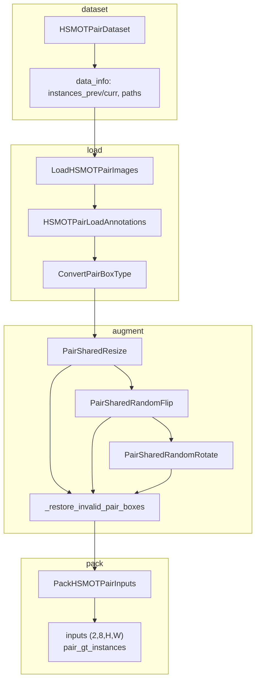

# M1 图像对数据管线修改报告

> **文档性质**：在 [o2_rtdetr_audit_report.md](./o2_rtdetr_audit_report.md)（只读审计、**未改代码**）之后，**开始实施 Pair 数据管线** 的改动记录。  
> 本报告仅覆盖 **M1：HSMOT Pair Dataset 与 transforms**；模型侧（Detector/Head/Preprocessor）仍按审计报告 §9–§11 规划，尚未接入。

| 项 | 内容 |
|----|------|
| 里程碑 | M1 — HSMOT 图像对（Pair）数据管线 |
| 前置文档 | [o2_rtdetr_audit_report.md](./o2_rtdetr_audit_report.md)（M1 前只读审计） |
| 日期 | 2026-06-16 |
| 仓库 | `/data/users/litianhao01/PairMmot/ai4rs` |
| 原则 | **新增文件为主，不修改单帧 `HSMOTDataset` 及原有 transforms** |

---

## 1. 目标与范围

### 1.1 目标

在现有单帧 HSMOT 检测数据管线之外，实现 **时序图像对** 数据加载与增强管线，满足 Pair MOT / 双帧检测训练的前置数据需求：

- 每个样本 = 同序列相邻（或可配置间隔）两帧 8 通道图像
- Pair 级 GT：按 **track id 并集** 对齐，支持持续 / 新生 / 消失
- 两帧共享 **resize、flip、rotate** 等几何变换
- 打包后 `batch_inputs.shape == [B, 2, 8, H, W]`

### 1.2 与审计报告的对应关系

审计报告（M1 前）已指出单帧栈的缺口；M1 主要落实 **数据侧** 规划中的 `hsmot_pair` / pair dataloader 部分：

| 审计报告 §10（当时不能复用） | M1 交付 |
|------------------------------|---------|
| 单帧 `HSMOTDataset` + `PackDetInputs` | 新增 `HSMOTPairDataset` + `PackHSMOTPairInputs` |
| `with_track_id=False`、无 pair GT | `pair_gt_instances` + track 对齐 |
| 单图几何增强 | `PairSharedResize` / `Flip` / `Rotate` |
| `MultispecDetDataPreprocessor` `(B,8,H,W)` | **未改**（留待 M2） |
| `RotatedRTDETR` / Head / DN / Assigner | **未改**（留待后续里程碑） |

### 1.3 不在本里程碑范围

- Pair 版 Detector / Head / 训练 config 接入
- `MultispecDetDataPreprocessor` 对 `(B,2,8,H,W)` 的支持
- 与 O2-RTDETR 模型端到端训练

---

## 2. 新增文件清单

| 路径 | 类型 | 说明 |
|------|------|------|
| `mmrotate/datasets/pair_gt.py` | 核心逻辑 | Pair GT 构建、`TrackIdClassMismatchError`、占位框常量 |
| `mmrotate/datasets/hsmot_pair.py` | Dataset | `HSMOTPairDataset` |
| `mmrotate/datasets/transforms/loading_hsmot_pair.py` | Transforms | 加载、标注、打包 |
| `mmrotate/datasets/transforms/transforms_hsmot_pair.py` | Transforms | 共享几何增强 |
| `mmrotate/datasets/transforms/visualize_hsmot_pair.py` | 工具 | 双图 + OBB 可视化 |
| `mmrotate/datasets/transforms/validate_hsmot_pair.py` | 工具 | Pair 样本自动校验 |
| `tests/test_datasets/test_hsmot_pair.py` | 测试 | 单元测试 + 合成场景可视化导出 |
| `tools/visualize_hsmot_pair_real.py` | CLI | 真实数据集随机可视化与校验 |

### 2.1 修改的注册文件（仅 export，无逻辑改动）

| 路径 | 变更 |
|------|------|
| `mmrotate/datasets/__init__.py` | 导出 `HSMOTPairDataset` |
| `mmrotate/datasets/transforms/__init__.py` | 导出 pair transforms、`validate_pair_results`、`visualize_hsmot_pair` |

### 2.2 未修改的单帧文件（保持原样）

- `mmrotate/datasets/hsmot.py` — `HSMOTDataset`
- `mmrotate/datasets/transforms/loading_hsmot.py` — 单帧加载与标注
- `projects/multispec_rotated_rtdetr/configs/hsmot.py` — 单帧训练 pipeline

---

## 3. 数据流与接口约定

### 3.1 样本索引（`HSMOTPairDataset`）

每个 `data_info` 在 `load_data_list()` 中生成：

```python
{
    'img_id': '{seq}_{curr:06d}_p{prev:06d}',
    'video_id': seq_name,
    'seq_name': seq_name,
    'frame_id': frame_id_curr,           # 当前帧，1-based MOT
    'frame_id_prev': frame_id_prev,
    'img_path': <curr 图像路径>,
    'img_path_prev': <prev 图像路径>,
    'instances_prev': [...],             # 与单帧 instance 格式一致
    'instances_curr': [...],
}
```

- `frame_interval`：默认 1，`frame_id_prev = frame_id_curr - frame_interval`
- `img_format`：`npy` 或 `3jpg`（与单帧一致）
- `train_half.txt` 下约 **3839** 对（`frame_interval=1`）

### 3.2 Pair GT 对齐（`build_pair_gt_from_instances`）

以 **track id 并集** 为行索引，排序后对齐：

| 字段 | 类型 | 说明 |
|------|------|------|
| `labels` | `(N,)` int64 | 类别；同 id 双帧类别不一致则抛 `TrackIdClassMismatchError` |
| `track_ids` | `(N,)` int64 | MOT track id |
| `bboxes_prev` | `(N, 8)` float32 | qbox；缺失侧为 `INVALID_QBOX_PLACEHOLDER`（全零） |
| `bboxes_curr` | `(N, 8)` float32 | 同上 |
| `valid_prev` | `(N,)` bool | 该 track 在 prev 帧是否存在 |
| `valid_curr` | `(N,)` bool | 该 track 在 curr 帧是否存在 |

语义示例：

| 场景 | valid_prev | valid_curr |
|------|------------|------------|
| 持续目标 | True | True |
| 新生 | False | True |
| 消失 | True | False |

### 3.3 Pipeline 推荐顺序

```python
train_pair_pipeline = [
    dict(type='LoadHSMOTPairImages'),
    dict(type='HSMOTPairLoadAnnotations', box_type='qbox'),
    dict(type='ConvertPairBoxType', dst_box_type='rbox'),
    dict(type='PairSharedResize', scale=(800, 1200), keep_ratio=True),
    dict(type='PairSharedRandomFlip', prob=0.5, direction=['horizontal', 'vertical']),
    dict(type='PairSharedRandomRotate', prob=0.5, angle_range=180),
    dict(type='PackHSMOTPairInputs'),
]
```

### 3.4 打包输出（`PackHSMOTPairInputs`）

```python
{
    'inputs': Tensor,           # (2, C, H, W)，C=8
    'data_samples': DetDataSample,
}
```

`default_collate` 后：

- `inputs` → `(B, 2, 8, H, W)`
- `data_samples[i].pair_gt_instances` → `InstanceData`：

| 字段 | 说明 |
|------|------|
| `labels` | `(N,)` |
| `track_ids` | `(N,)` |
| `bboxes_prev` | `RotatedBoxes` `(N, 5)` |
| `bboxes_curr` | `RotatedBoxes` `(N, 5)` |
| `valid_prev` | `(N,)` bool |
| `valid_curr` | `(N,)` bool |

`metainfo` 保留：`img_id`, `img_path`, `img_path_prev`, `ori_shape`, `img_shape`, `scale_factor`, `flip`, `flip_direction`, `video_id`, `seq_name`, `frame_id`, `frame_id_prev`。

---

## 4. 各模块说明

### 4.1 `LoadHSMOTPairImages`

- 读取 `img_path_prev` 与 `img_path`，支持 `.npy` 与 3-JPG 拼 8 通道
- `results['img'] = [img_prev, img_curr]`，各 `(H, W, 8)`
- 两帧 shape 不一致时 `ValueError`

### 4.2 `HSMOTPairLoadAnnotations`

- 调用 `build_pair_gt_from_instances`
- 写入 `pair_*` 对齐字段
- 同时生成 `gt_bboxes_prev` / `gt_bboxes_curr`（`QuadriBoxes`），供几何变换使用

### 4.3 `ConvertPairBoxType`

- 将两路 `gt_bboxes_*` 转为 `rbox`（或其它目标 box type）

### 4.4 共享几何变换

| 类 | 行为 |
|----|------|
| `PairSharedResize` | 先在 frame0 上 `Resize.transform` 采样 scale，再对 frame1 **复用同一 scale_factor** 仅 `_resize_img` + `_resize_bboxes` |
| `PairSharedRandomFlip` | 用 dummy 图采样 flip 决策，再对两帧各 `_flip` **一次**（避免双次翻转） |
| `PairSharedRandomRotate` | `@cache_randomness` 采样同一角度，两帧同步旋转 |

公共辅助：

- `_restore_invalid_pair_boxes`：几何变换后将 `valid_*=False` 行的 bbox 清零，保持 new/disappear 占位语义

### 4.5 `PairSharedRandomRotate` 特殊处理

- **不调用** `Rotate._filter_invalid`：否则占位框（原点零框）会被滤除，导致 `gt_bboxes_*` 行数与 `pair_track_ids` 不一致
- 旋转后调用 `_restore_invalid_pair_boxes` 恢复占位

---

## 5. 可视化与校验

### 5.1 `visualize_hsmot_pair`

- 左右拼接 prev / curr（RGB 预览为前 3 通道）
- 绿色框 = valid，灰色 = invalid；红色 = 中心越界（OOB）
- 标注 `id=`、`a=`（角度）、`new=` / `dis=` 统计
- 底部 banner：序列/帧号、flip、scale、PASS/FAIL

### 5.2 `validate_hsmot_pair`

| 检查项 | 内容 |
|--------|------|
| `id_alignment` | 与 raw instances 重建的 track_ids / valid 一致 |
| `new_disappear` | 占位框与 valid 标志一致 |
| `angle_range` | valid rbox 角度在 le90 范围 |
| `bbox_in_bounds` | valid 框中心在图像内（角点可略出界） |
| `shared_geometry` | 两帧同 shape、scale_factor 一致、flip 一致 |
| `shared_rotation` | 持续目标两帧旋转增量一致 |

### 5.3 合成场景测试可视化

```bash
cd ai4rs
python tests/test_datasets/test_hsmot_pair.py --vis
```

输出：`PairMmot/tmp/hsmot_pair_test_vis/`（7 类合成场景）

### 5.4 真实数据随机校验（100 对）

```bash
cd ai4rs
python tools/visualize_hsmot_pair_real.py --num 100 --seed 42
```

输出：`PairMmot/tmp/hsmot_pair_real_vis/`

**seed=42, 100 对结果摘要**（`train_half`, `frame_interval=1`）：

| 检查项 | 通过率 |
|--------|--------|
| ID 对齐 | 100/100 |
| 新生/消失标记 | 100/100 |
| 共享几何（尺寸/scale/flip） | 100/100 |
| 角度范围 / 共享旋转 | 全部通过 |
| 边界框中心在图内 | 约 50/100（旋转后边缘目标，预期现象） |

---

## 6. 单元测试

文件：`tests/test_datasets/test_hsmot_pair.py`

| 测试类 | 覆盖点 |
|--------|--------|
| `TestBuildPairGT` | 持续/新生/消失、空帧、类别不一致异常、不同目标数 |
| `TestHSMOTPairDataset` | 临时目录索引、`frame_id` / `frame_id_prev` |
| `TestHSMOTPairPipeline` | pack shape `(2,8,H,W)`、共享 flip、resize 同 scale、共享 rotate |
| `TestHSMOTPairVisualExport` | 合成场景 JPG 导出 |

运行：

```bash
pytest tests/test_datasets/test_hsmot_pair.py -v
```

**11 passed**（py310）。

---

## 7. 已修复问题

### 7.1 `PairSharedRandomFlip` 双次翻转

**现象**：先对 probe 调 `flip.transform`，再对同一帧 `_flip`，bbox 被翻转两次。

**修复**：dummy 图仅用于采样 `flip` / `flip_direction`，再对 prev、curr 各 `_flip` 一次。

### 7.2 `PairSharedRandomRotate` 破坏行对齐

**现象**：`Rotate._filter_invalid` 按帧过滤，占位框被删，`PackHSMOTPairInputs` 报 `AssertionError`（bbox 行数 ≠ track 数）。

**修复**：pair 旋转跳过 `_filter_invalid`；变换后 `_restore_invalid_pair_boxes`。

### 7.3 几何变换后占位框非零

**现象**：new/disappear 侧占位框经 rotate 后非零，`new_disappear` 校验失败。

**修复**：每个共享几何 transform 末尾调用 `_restore_invalid_pair_boxes`。

---

## 8. 与单帧管线对比

| 维度 | 单帧 `HSMOTDataset` | Pair `HSMOTPairDataset` |
|------|---------------------|-------------------------|
| 样本粒度 | 1 帧 | 2 帧（prev + curr） |
| GT 容器 | `gt_instances` | `pair_gt_instances` |
| 图像张量 | `(B, 8, H, W)` | `(B, 2, 8, H, W)` |
| track 对齐 | 无 | `track_ids` + `valid_prev/curr` |
| 几何增强 | 单图 `Resize/Flip/Rotate` | `PairShared*` 双帧同步 |
| 打包 | `PackDetInputs` | `PackHSMOTPairInputs` |

---

## 9. 架构图



---

## 10. 后续工作（M2+ 建议）

1. **训练 config**：`hsmot_pair.py` + `train_pair_pipeline` 写入 `projects/multispec_rotated_rtdetr/configs/`
2. **DataPreprocessor**：`MultispecDetDataPreprocessor` 或 `PairMultispecDataPreprocessor` 支持 `(B,2,8,H,W)`
3. **模型**：`PairRotatedRTDETR` 双帧 `extract_feat` / memory 融合（见 `o2_rtdetr_audit_report.md` §9–11）
4. **DN / Assigner**：基于 `pair_gt_instances` 的跨帧 DN 与匹配代价

---

## 11. 修订记录

| 日期 | 说明 |
|------|------|
| 2026-06-16 | M1 图像对数据管线初版完成报告 |
