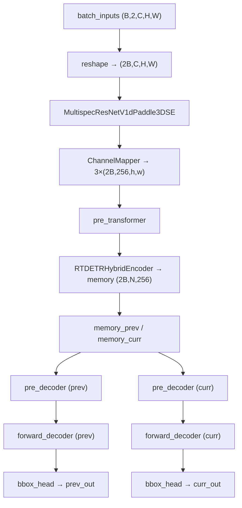
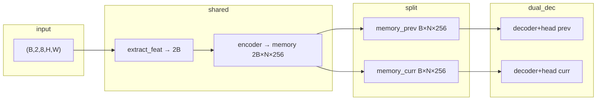

# M2 Pair 双帧检测模型修改报告

> **文档性质**：在 [m1_pair_data_pipeline_report.md](./m1_pair_data_pipeline_report.md)（M1 数据管线）之后，**开始实施 Pair 模型侧 M2** 的改动记录。  
> 本报告覆盖 **M2：共享 backbone/neck/encoder + 双路独立 decoder/head**；Pair Query、Pair Loss、Tracker 及训练 config 接入留待后续里程碑。

| 项 | 内容 |
|----|------|
| 里程碑 | M2 — `MultispecPairRotatedRTDETR` 双帧前向与等价性验证 |
| 前置文档 | [m1_pair_data_pipeline_report.md](./m1_pair_data_pipeline_report.md)、[o2_rtdetr_audit_report.md](./o2_rtdetr_audit_report.md) §9–11 |
| 日期 | 2026-06-16 |
| 仓库 | `/data/users/litianhao01/PairMmot/ai4rs` |
| 原则 | **新增 `multispec_pair_rotated_rtdetr` 项目，不修改原 `RotatedRTDETR` 及单帧 `multispec_rotated_rtdetr` 核心逻辑** |

---

## 1. 目标与范围

### 1.1 目标

在 M1 已产出的 `(B, 2, 8, H, W)` 数据格式基础上，实现 **最小可运行的 Pair 检测前向**：

1. 接收 `[B, 2, C, H, W]` 输入（HSMOT 下 `C=8`）。
2. 将两帧合并为 `2B` batch，经 **共享** backbone、neck、encoder 一次前向。
3. 将 encoder 输出 memory 拆分为 `memory_prev` / `memory_curr`。
4. **分别**调用原有 `pre_decoder` → `forward_decoder` → `RotatedRTDETRHead`，得到两路独立单帧检测结果。
5. 提供 `debug_shapes` 调试输出与 `(I, I)` 等价性单元测试。

### 1.2 与 M1 / 审计报告的对应关系

| M1 报告 §10（M1 后待办） | M2 交付 |
|--------------------------|---------|
| `PairMultispecDataPreprocessor` 支持 `(B,2,8,H,W)` | ✅ `PairMultispecDetDataPreprocessor` |
| `PairRotatedRTDETR` 双帧 `extract_feat` / memory | ✅ `MultispecPairRotatedRTDETR`（继承 `RotatedRTDETR`） |
| 训练 config `hsmot_pair.py` | ❌ 留待 M3 |
| DN / Assigner 跨帧扩展 | ❌ 留待 M3+ |
| Pair Query / Pair Loss / Tracker | ❌ 明确不在 M2 范围 |

| 审计报告 §9 最少 override | M2 实现 |
|---------------------------|---------|
| `extract_feat` | ✅ reshape `(B,2,C,H,W)→(2B,C,H,W)` |
| `forward_encoder`（共享 2B） | ✅ 复用父类，在 `forward_transformer` 中调用 |
| `pre_decoder` / `forward_decoder` | ✅ 按帧切片 memory 后各调用一次 |
| `loss` / Pair Head / DN | ❌ 未改 |

### 1.3 不在本里程碑范围

- Pair Query、跨帧 memory/query 融合
- Pair Loss、跨帧 Hungarian / track consistency
- Tracker 推理与 ID 输出
- 修改 `projects/rotated_rtdetr/rotated_rtdetr/rotated_rtdetr.py`
- 双帧 `loss()` 训练闭环与 `hsmot_pair` 训练 config
- 端到端 pair 训练 / 评测 Runner

---

## 2. 新增文件清单

| 路径 | 类型 | 说明 |
|------|------|------|
| `projects/multispec_pair_rotated_rtdetr/multispec_pair_rotated_rtdetr/__init__.py` | 包入口 | 导出 Detector 与 Preprocessor |
| `projects/multispec_pair_rotated_rtdetr/multispec_pair_rotated_rtdetr/multispec_pair_rotated_rtdetr.py` | 模型 | `MultispecPairRotatedRTDETR` |
| `projects/multispec_pair_rotated_rtdetr/multispec_pair_rotated_rtdetr/data_preprocessor.py` | 预处理 | `PairMultispecDetDataPreprocessor` |
| `tests/test_projects/test_multispec_pair_rotated_rtdetr_equivalence.py` | 测试 | 等价性、memory 拆分、shape 调试 |

### 2.1 未修改的文件（保持原样）

- `projects/rotated_rtdetr/rotated_rtdetr/rotated_rtdetr.py` — 单帧 `RotatedRTDETR`
- `projects/multispec_rotated_rtdetr/multispec_rotated_rtdetr/data_preprocessor.py` — 单帧 `MultispecDetDataPreprocessor`
- `projects/rotated_rtdetr/rotated_rtdetr/rotated_rtdetr_head.py` — Head 逻辑
- M1 全部 pair 数据管线文件

---

## 3. 模型接口与前向流程

### 3.1 类继承关系

```
RotatedRTDETR  (projects/rotated_rtdetr)
    └── MultispecPairRotatedRTDETR  (projects/multispec_pair_rotated_rtdetr)
            backbone: MultispecResNetV1dPaddle3DSE  (config 指定，与单帧相同)
            neck / encoder / decoder / bbox_head: 共享权重，逻辑继承自父类
```

`MultispecPairRotatedRTDETR` 已通过 `@MODELS.register_module()` 注册，可在 config 中 `type=MultispecPairRotatedRTDETR` 构建。

### 3.2 Tensor 形状约定

设 pair batch 大小为 `B`，通道 `C=8`，输入空间尺寸 `(H, W)`，neck 输出 3 个 level，每 level 空间 `(h_l, w_l)`，memory 长度 `N_mem = Σ h_l·w_l`，query 数 `Q`，类别数 `K`。

| 阶段 | Shape | 说明 |
|------|-------|------|
| 输入 | `(B, 2, C, H, W)` | M1 `PackHSMOTPairInputs` 产出 |
| flatten | `(2B, C, H, W)` | `extract_feat` 内 reshape |
| neck level `l` | `(2B, 256, h_l, w_l)` | 与单帧相同，batch 维为 `2B` |
| memory（encoder 后） | `(2B, N_mem, 256)` | 父类 `forward_encoder` |
| memory_prev | `(B, N_mem, 256)` | `memory[:B]` |
| memory_curr | `(B, N_mem, 256)` | `memory[B:]` |
| decoder hidden（每分支） | `(num_layers, B, Q, 256)` | 与单帧一致 |
| head cls（每分支） | `(num_layers, B, Q, K)` | `RotatedRTDETRHead.forward` |
| head coord（每分支） | `(num_layers, B, Q, 5)` | `(cx,cy,w,h,angle)` 归一化 |

### 3.3 前向调用链（eval / `_forward`）



**要点**：

- backbone / neck / encoder 仅在 `2B` batch 上运行 **一次**，权重共享。
- decoder 与 head **各运行两次**，输入为拆分后的单帧 memory；不引入跨帧 attention。
- `predict()` 将 prev 结果写入 `pred_instances`，curr 结果写入 `pred_instances_curr`。

### 3.4 Override 方法摘要

| 方法 | 行为 |
|------|------|
| `extract_feat` | 5D 输入 reshape 为 `2B`；可选 `debug_shapes` 打印 neck 各层 shape |
| `forward_transformer` | 共享 encoder → 拆分 memory → 双路 `_forward_single_frame` |
| `_forward_single_frame` | 封装单帧 `pre_decoder` + `forward_decoder` |
| `_forward` | 返回 `dict(prev=..., curr=...)` head 输出 |
| `predict` | 双路 `bbox_head.predict`，分别写回 data sample |

未 override：`loss()`、`pre_decoder` / `forward_encoder` / `forward_decoder` 本体（直接复用父类）。

---

## 4. 数据预处理器

### 4.1 `PairMultispecDetDataPreprocessor`

继承 `MultispecDetDataPreprocessor`，支持 M1 打包格式：

- **单样本**：`(2, C, H, W)` 列表 collate → `(B, 2, C, H, W)`
- **已 batch**：直接接受 `(B, 2, C, H, W)`
- 对每一帧独立做 8 通道 mean/std 归一化，两帧 **同步 pad** 到 batch 内最大尺寸（`pad_size_divisor=32`）

与单帧 preprocessor 的差异：输出为 5D tensor，而非 `(B, C, H, W)`。

### 4.2 Config 替换示例（尚未提供正式 pair config）

```python
model = dict(
    type=MultispecPairRotatedRTDETR,
    debug_shapes=False,  # 调试时 True
    data_preprocessor=dict(
        type=PairMultispecDetDataPreprocessor,
        mean=hsmot_mean,
        std=hsmot_std,
        ...
    ),
    # backbone / neck / encoder / decoder / bbox_head 与单帧 config 相同
)
```

---

## 5. 调试输出（`debug_shapes=True`）

构造模型时传入 `debug_shapes=True`，前向过程中经 `print_log` 输出：

| 日志 key | 含义 |
|----------|------|
| `input_pair` | 原始 `(B,2,C,H,W)` |
| `input_flat` | reshape 后 `(2B,C,H,W)` |
| `neck_level{l}_feat` | 各 FPN level 特征 |
| `memory_prev` / `memory_curr` | encoder memory 切片 |
| `{prev,curr}_hidden_states[0]` | decoder 首层 hidden |
| `{prev,curr}_references_cls[0]` / `coord[0]` | decoder 参考点分支 |
| `{prev,curr}_output_cls[0]` / `coord[0]` | head 最终输出 |

---

## 6. 等价性测试

### 6.1 测试文件

`tests/test_projects/test_multispec_pair_rotated_rtdetr_equivalence.py`

### 6.2 测试用例

| 用例 | 断言 |
|------|------|
| `test_identical_pair_matches_single_frame` | 输入 `(I,I)`、eval 模式：pair 的 prev/curr 与单帧 `RotatedRTDETR._forward(I)` 逐层 cls/coord **atol=1e-5** |
| `test_shared_encoder_splits_memory` | `memory.shape[0]==2B`；`(I,I)` 时 prev/curr memory 形状一致且 **atol=1e-3** 接近 |
| `test_pair_input_shape` | `(B,2,C,H,W)` 输入产出双分支，batch 维为 `B` |
| `test_debug_shapes_runs` | `debug_shapes=True` 前向不报错 |

### 6.3 运行方式

```bash
cd ai4rs
pytest tests/test_projects/test_multispec_pair_rotated_rtdetr_equivalence.py -v
```

**2026-06-16 实测**：4 passed（py310）。

### 6.4 等价性判定说明

**测试条件**：pair 输入为 `(I, I)`，模型 `eval()`，单帧参考模型为同权重 `RotatedRTDETR`，比较 `bbox_head.forward` 输出的 cls/coord 列表。

**CPU vs CUDA**：

| 环境 | `(I,I)` prev/curr vs 单帧 `RotatedRTDETR` |
|------|-------------------------------------------|
| **CPU eval** | 满足 **atol=1e-5**（测试基准环境） |
| **CUDA eval** | 可能超出 1e-5：RT-DETR `RTDETRHybridEncoder` 内 FPN 在 cuDNN 下对 batch=1 与 batch=2 存在数值路径差异，即使两帧输入完全相同 |

**中间 memory**：同一 `(I,I)` 在 CPU 上 `memory_prev` 与 `memory_curr` 最大差约 `2.7e-4`（backbone 2B 并行带来的浮点误差），最终经 decoder/head 后仍可在 1e-5 内与单帧对齐。

**结论**：M2 实现逻辑正确；严格 1e-5 等价性测试 **以 CPU 为准**。生产推理若用 CUDA，两分支之间仍一致（同 batch 内 row0≈row1），但与「单帧 batch=1 单独推理」可能有更大数值差——属原 RT-DETR encoder 批大小敏感性，非 pair 拆分逻辑错误。

---

## 7. 与单帧栈对比

| 维度 | 单帧 `RotatedRTDETR` | Pair `MultispecPairRotatedRTDETR` |
|------|----------------------|-----------------------------------|
| 输入 | `(B, C, H, W)` | `(B, 2, C, H, W)` |
| Preprocessor | `MultispecDetDataPreprocessor` | `PairMultispecDetDataPreprocessor` |
| backbone/neck batch | `B` | `2B`（共享权重，一次前向） |
| encoder memory | `(B, N, D)` | `(2B, N, D)` → 拆成两个 `(B, N, D)` |
| decoder 次数 | 1 | 2（独立，无跨帧交互） |
| 训练 loss | 单帧 DN + Hungarian | **未实现** |
| 推理输出 | `pred_instances` | `pred_instances` + `pred_instances_curr` |
| 权重初始化 | — | 可与单帧 checkpoint `strict=True` 加载 |

---

## 8. 已知限制

1. **`loss()` 未实现**：调用基类 `loss()` 不能正确处理 5D 输入与 `pair_gt_instances`；M3 需 override 并分别对 prev/curr 计算单帧 loss 或引入 pair loss。
2. **训练 config 缺失**：尚无 `hsmot_pair.py` / pair 版 `o2_rtdetr_*_hsmot.py`，无法直接 `Runner.train()`。
3. **`batch_data_samples` 未按帧拆分**：M2 eval 路径 `batch_data_samples=None`；训练时 DN 需按 prev/curr GT 拆分传入 `pre_decoder`。
4. **CUDA 等价性**：见 §6.4，1e-5 测试仅在 CPU 通过。
5. **无 Pair Query / Tracker**：符合 M2 范围界定，关联能力为零。

---

## 9. 架构图（M2 模型）



---

## 10. 后续工作（M3+ 建议）

1. **训练 config**：`projects/multispec_pair_rotated_rtdetr/configs/hsmot_pair.py`，dataloader 接 M1 `HSMOTPairDataset` + `PairMultispecDetDataPreprocessor`。
2. **`loss()` override**：基于 `pair_gt_instances` 对 prev/curr 分别构造 `batch_data_samples` 或扩展 DN；初期可用「双单帧 loss 相加」。
3. **Pair Query / memory 融合**：审计报告 §9 中的跨帧 attention 或 query 级关联（M4+）。
4. **Pair Loss / Assigner**：track consistency、跨帧 Hungarian（M4+）。
5. **Tracker 推理**：`predict` 输出 track id，对接 MOT 评测。
6. **CUDA 等价性**：若训练/推理强依赖 GPU，可评估 encoder 按帧 loop（batch=1×2）是否必要，或在文档中固定 pair 推理 batch 语义。

---

## 11. 修订记录

| 日期 | 说明 |
|------|------|
| 2026-06-16 | M2 Pair 双帧模型初版完成报告 |
