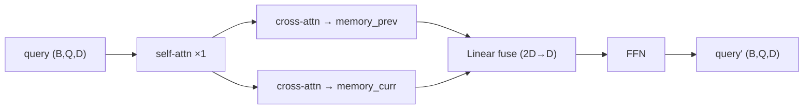

# M3j Pair 双帧 Decoder 修改报告

> **文档性质**：在 [m2_pair_model_report.md](./m2_pair_model_report.md)（M2 双帧独立 decoder）之后，**实施 M3j：Pair 共享 Query + 双 Reference 的 Transformer Decoder**。  
> 本里程碑仅交付 **Decoder / DecoderLayer 模块与单元测试**；接入 `MultispecPairRotatedRTDETR`、Pair Head、Loss、DN 留待后续。

| 项 | 内容 |
|----|------|
| 里程碑 | M3j — `PairRotatedRTDETRTransformerDecoder` + `PairRotatedRTDETRTransformerDecoderLayer` |
| 前置文档 | [m2_pair_model_report.md](./m2_pair_model_report.md)、[o2_rtdetr_audit_report.md](./o2_rtdetr_audit_report.md) §9 |
| 日期 | 2026-06-16 |
| 仓库 | `/data/users/litianhao01/PairMmot/ai4rs` |
| 原则 | **新增 pair decoder 文件，不修改 `RotatedRTDETRTransformerDecoder` 及原 O2-RTDETR 核心文件** |

---

## 1. 目标与范围

### 1.1 目标

实现 Pair MOT 所需的 **跨帧交互 Decoder**，满足以下设计要求：

1. 一个 Pair Query：**一个共享 content query** + **两个独立 5D oriented reference boxes**（prev / curr）。
2. 每层 **仅一次 query self-attention**，使不同目标对（pair queries）可交互。
3. 分别对 `memory_prev`、`memory_curr` 执行 **rotated multi-scale deformable cross-attention**。
4. 使用 **线性层** 融合两侧 cross-attention 输出。
5. **分别迭代更新** `reference_prev`、`reference_curr`。
6. **完整复用** O2-RTDETR 角度表示及 angle refinement（`MLP(5→D)` + `angle_factor` + `inverse_sigmoid` 迭代），不重新定义角度编码。
7. 返回所有 decoder 层的 `hidden_states`、`references_prev`、`references_curr`。
8. 当前使用 **临时 learned query / learned dual references**（`nn.Embedding`）。
9. **暂不实现** denoising query。
10. 单元测试覆盖 shape、梯度、AMP、batch size=1/2。

### 1.2 与 M2 的对应关系

| M2 状态 | M3j 交付 |
|---------|----------|
| 双路独立 `RotatedRTDETRTransformerDecoder` | ✅ 新增独立 Pair Decoder 模块（尚未替换 M2 双路 decoder） |
| Pair Query / 跨帧 fusion | ✅ Decoder 层内 self-attn + 双 cross-attn + fusion |
| `pre_decoder` Top-K query | ❌ M3j 使用 learned placeholder；Top-K 接入留待 M3k+ |
| Pair Loss / valid mask | ❌ 留待 M3k+（见 §6） |
| 训练 config `hsmot_pair.py` | ❌ 留待 M3k+ |

### 1.3 不在本里程碑范围

- 修改 `RotatedRTDETRTransformerDecoder` / `rotated_rtdetr_layers.py`
- 将 Pair Decoder 接入 `MultispecPairRotatedRTDETR.forward_transformer`
- Pair Head、双分支 cls/reg 输出
- Denoising query / `PairCdnQueryGenerator`
- `loss()`、`valid_mask` 屏蔽缺失帧 box loss
- Tracker 推理

---

## 2. 新增 / 修改文件清单

| 路径 | 类型 | 说明 |
|------|------|------|
| `projects/multispec_pair_rotated_rtdetr/multispec_pair_rotated_rtdetr/pair_rotated_rtdetr_layers.py` | **新增** | `PairRotatedRTDETRTransformerDecoderLayer`、`PairRotatedRTDETRTransformerDecoder` |
| `projects/multispec_pair_rotated_rtdetr/multispec_pair_rotated_rtdetr/__init__.py` | 修改 | 导出上述两个类 |
| `tests/test_projects/test_pair_rotated_rtdetr_decoder.py` | **新增** | M3j 单元测试（9 项） |

### 2.1 未修改的文件（保持原样）

- `projects/rotated_rtdetr/rotated_rtdetr/rotated_rtdetr_layers.py` — 原 `RotatedRTDETRTransformerDecoder`
- `projects/multispec_pair_rotated_rtdetr/.../multispec_pair_rotated_rtdetr.py` — M2 双路 decoder 逻辑
- `projects/rotated_dino/rotated_dino/rotated_attention.py` — 复用 `RotatedMultiScaleDeformableAttention`

---

## 3. 关键设计

### 3.1 类继承关系

```
DetrTransformerDecoderLayer (mmdet)
    └── PairRotatedRTDETRTransformerDecoderLayer
            self_attn: MultiheadAttention
            cross_attn_prev / cross_attn_curr: RotatedMultiScaleDeformableAttention
            cross_fusion: Linear(2D → D)

DinoTransformerDecoder (mmdet)
    └── PairRotatedRTDETRTransformerDecoder
            ref_point_head: MLP(5, 2D, D, 2)   # 与 O2-RTDETR 相同
            query_content: Embedding(Q, D)      # 临时 learned query
            reference_prev_embed / reference_curr_embed: Embedding(Q, 5)
```

### 3.2 单层前向（DecoderLayer）



- **Self-attn 位置编码**：`query_pos = 0.5 * (ref_point_head(ref_prev) + ref_point_head(ref_curr))`，shape `(B, Q, D)`。
- **Cross-attn 位置编码**：prev / curr 各自用对应 5D reference 经 `ref_point_head` 得到。
- **Reference 输入 deformable attn**：`(B, Q, num_levels, 5)`，末维 angle 乘 `angle_factor`（与 O2-RTDETR 一致）。

### 3.3 Decoder 层间 reference 更新

与 `RotatedRTDETRTransformerDecoder` 相同模式，对 **两侧 reference 独立** 应用同一层 `reg_branches[lid]` 输出：

```python
tmp = reg_branches[lid](query)  # (B, Q, 5)
reference_prev = (tmp + inverse_sigmoid(reference_prev)).sigmoid().detach()
reference_curr = (tmp + inverse_sigmoid(reference_curr)).sigmoid().detach()
```

两侧初始 reference 不同（learned embedding 初始化略有偏移），加上 dual cross-attn 后 query 演化，逐层 reference 可独立变化。

### 3.4 Tensor 形状约定

设 batch `B`，query 数 `Q`，embed `D`，memory 长度 `N`，level 数 `L`。

| Tensor | Shape | 说明 |
|--------|-------|------|
| `memory_prev` / `memory_curr` | `(B, N, D)` | 两帧 encoder memory |
| `query`（learned 或外部传入） | `(B, Q, D)` | 共享 content query |
| `reference_prev` / `reference_curr` | `(B, Q, 5)` | sigmoid 空间 5D box |
| `ref_*_input`（cross-attn） | `(B, Q, L, 5)` | angle 维已 × `angle_factor` |
| `hidden_states[i]` | `(B, Q, D)` | 第 i 层输出 |
| `references_prev[i]` / `references_curr[i]` | `(B, Q, 5)` | 第 i 层 reference |

### 3.5 对外 API

```python
hidden_states, references_prev, references_curr = decoder(
    memory_prev=...,           # (B, N, D)
    memory_curr=...,           # (B, N, D)
    spatial_shapes=...,        # (L, 2)
    level_start_index=...,     # (L,)
    reg_branches=...,          # ModuleList[Linear(D, 5)] × num_layers
    query=None,                # 可选 override
    reference_prev=None,
    reference_curr=None,
)
```

返回三个 **list**，长度均为 `num_layers`。

---

## 4. 测试结果

环境：`conda py310`，工作目录 `ai4rs/`。

### 4.1 单元测试

```bash
/data/users/litianhao01/anaconda3/envs/py310/bin/python -m pytest \
  tests/test_projects/test_pair_rotated_rtdetr_decoder.py -v
```

| 测试项 | 结果 | 验收点 |
|--------|------|--------|
| `test_output_shapes_batch1` | ✅ PASS | batch=1 shape |
| `test_output_shapes_batch2` | ✅ PASS | batch=2 shape |
| `test_references_change_across_layers` | ✅ PASS | 两侧 reference 逐层变化 |
| `test_memory_swap_changes_outputs` | ✅ PASS | 交换 memory 后输出对应变化 |
| `test_gradients_reach_both_memories` | ✅ PASS | 梯度同时进入两帧 memory |
| `test_no_nan_or_inf` | ✅ PASS | 无 NaN/Inf |
| `test_amp_fp16_forward` | ✅ PASS | CUDA FP16 autocast 前向 |
| `test_static_import_from_package` | ✅ PASS | 包级静态导入 |
| `test_config_build_minimal_forward` | ✅ PASS | O2 debug config 参数构建 + 前向 |

**合计：9 passed**（2026-06-16，py310）。

### 4.2 最小前向

```bash
cd ai4rs && /data/users/litianhao01/anaconda3/envs/py310/bin/python -c "
import torch
from projects.multispec_pair_rotated_rtdetr.multispec_pair_rotated_rtdetr import PairRotatedRTDETRTransformerDecoder
# ... 1-layer, Q=4, D=32 ...
"
# 输出: minimal forward ok torch.Size([1, 4, 32]) torch.Size([1, 4, 5]) torch.Size([1, 4, 5])
```

---

## 5. 验收对照

| 设计要求 | 状态 |
|----------|------|
| 共享 content query + 双 5D reference | ✅ |
| 每层一次 self-attn | ✅ |
| 双 rotated deformable cross-attn | ✅ |
| Linear 融合 cross 输出 | ✅ |
| 分别更新 reference_prev / reference_curr | ✅ |
| 复用 O2 angle 表示与 refinement | ✅ |
| 返回各层 hidden + dual references | ✅ |
| 临时 learned query / dual refs | ✅ |
| 无 denoising query | ✅ |
| shape / 梯度 / AMP / B=1,2 测试 | ✅ |
| 不修改原 `RotatedRTDETRTransformerDecoder` | ✅ |

---

## 6. 仍未完成的事项（M3k+）

1. **Detector 接入**：在 `MultispecPairRotatedRTDETR` 中用 Pair Decoder 替换 M2 双路独立 decoder；`pre_decoder` 产出 Top-K pair query 替代 learned embedding。
2. **Pair Head**：基于 `hidden_states` + `references_prev/curr` 输出双帧 cls/bbox（或共享 cls + 双 reg）。
3. **Denoising query**：`PairCdnQueryGenerator` 与 self-attn mask。
4. **Loss + valid mask**：缺失帧的 box loss 须通过 `valid_mask` 屏蔽（M1 `pair_gt` 已有 `valid_prev` / `valid_curr` 字段，尚未接入 loss）。
5. **训练 config**：`hsmot_pair.py` 与端到端训练闭环。
6. **M2 等价性回归**：接入 Pair Decoder 后需新的等价性 / 回归测试（`(I,I)` 输入下 prev/curr 应对齐单帧行为）。

---

## 7. 修订记录

| 日期 | 说明 |
|------|------|
| 2026-06-16 | M3j Pair Decoder 初版完成报告 |
