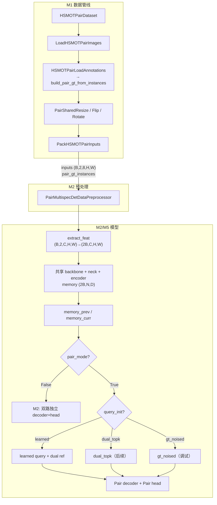

# M4 阶段性报告：Pair MOT 当前实现逻辑

> **文档性质**：截至 2026-06-17 的 **实现现状汇总**，整合 M1–M4 里程碑、M3-1 Query 初始化修正、M3-2 Decoder 双回归/梯度修正与 M5 端到端接入进展。  
> **前置文档**：[README.md](./README.md) 所列各里程碑报告（M1–M4、M3-1、M3-2）、[o2_rtdetr_audit_report.md](./o2_rtdetr_audit_report.md)  
> **核心代码**：`mmrotate/datasets/hsmot_pair.py`、`projects/multispec_pair_rotated_rtdetr/`

| 项 | 内容 |
|----|------|
| 日期 | 2026-06-17 |
| 仓库 | `/data/users/litianhao01/PairMmot/ai4rs` |
| 当前阶段 | **M5 进行中**：`pair_mode=True` + `query_init='learned'` 过拟合验收 |

---

## 1. 项目目标与里程碑进度

Pair MOT 在 O2-RTDETR（旋转框 RT-DETR）基础上，将 **同序列相邻两帧** 作为一对输入，学习 **跨帧关联的旋转框检测**：一个 Query 对应一个 track 在 prev/curr 两帧上的完整状态（持续 / 新生 / 消失）。

| 里程碑 | 内容 | 状态 |
|--------|------|------|
| M0 | O2-RTDETR 只读审计 | ✅ 完成 |
| M1 | HSMOT Pair 数据管线 | ✅ 完成 |
| M2 | `MultispecPairRotatedRTDETR` 双路独立 decoder | ✅ 完成（`pair_mode=False`） |
| M3j | `PairRotatedRTDETRTransformerDecoder` | ✅ 完成 |
| M3-1 | learnable query/ref 默认过拟合 + `query_init` 三模式 | ✅ 完成 |
| M3-2 | 双回归分支 + 有序 pos 融合 + DINO 式 reference 梯度 | ✅ 完成 |
| M4 | `PairRotatedRTDETRHead` + `PairHungarianAssigner` | ✅ 完成 |
| M5 | Detector 接入 + 训练 config + overfit 验收 | 🔄 **进行中** |
| 后续 | Encoder Top-K 集成验收、DN query、全量 HSMOT 训练、Tracker 推理 | ❌ 未开始 |

---

## 2. 端到端数据流



### 2.1 样本索引（`HSMOTPairDataset`）

`load_data_list()` 遍历序列 MOT 标注，以 `frame_interval`（默认 1）构造 prev/curr 帧对：

```python
frame_id_prev = frame_id_curr - frame_interval
# 每个 data_info 含：
# img_path / img_path_prev, instances_prev / instances_curr, track 元信息
```

关键逻辑见 `hsmot_pair.py`：

- 序列列表来自 `ann_file`（如 `train_half.txt`）或 `mot/*.txt` 目录
- 支持 `npy`（8 通道 `.npy`）与 `3jpg`（`_p1.jpg` 拼 8 通道）两种图像格式
- `require_prev_image=True` 时跳过 prev 帧缺失的 pair
- `filter_empty_gt` 可选过滤 prev/curr 均为空的 pair

### 2.2 Pair GT 对齐（`build_pair_gt_from_instances`）

以 **track id 并集** 为行索引，对齐两帧标注：

| 字段 | 含义 |
|------|------|
| `labels` | 类别（同 id 双帧类别不一致抛 `TrackIdClassMismatchError`） |
| `track_ids` | MOT track id |
| `bboxes_prev` / `bboxes_curr` | qbox `(N,8)`；缺失侧为全零占位 |
| `valid_prev` / `valid_curr` | 该 track 在对应帧是否存在 |

| 场景 | valid_prev | valid_curr |
|------|------------|------------|
| 持续目标 | True | True |
| 新生 | False | True |
| 消失 | True | False |

Pipeline 打包后 `collate` → `(B, 2, 8, H, W)`，`data_samples[i].pair_gt_instances` 含上述字段（rbox 5 维）。

---

## 3. 模型：`MultispecPairRotatedRTDETR`

继承 `RotatedRTDETR`，通过 **`pair_mode`** 与 **`query_init`** 控制前向路径：

| 开关 | 取值 | 行为 |
|------|------|------|
| `pair_mode` | `False` | M2：双路独立 decoder + `RotatedRTDETRHead` |
| `pair_mode` | `True` | M5：Pair decoder + `PairRotatedRTDETRHead` |
| `query_init` | `'learned'`（**过拟合默认**） | learnable Pair token + 双 learnable reference |
| `query_init` | `'gt_noised'` | learnable query + GT 加噪 reference（**调试**） |
| `query_init` | `'dual_topk'` | Encoder Top-K query + 双 reference（**后续集成**） |

### 3.1 特征提取（共享）

- 输入 `(B, 2, C, H, W)` → flatten 为 `(2B, C, H, W)`
- backbone / neck 一次前向，权重共享

### 3.2 Transformer 前向（`forward_transformer`）

**M2 路径（`pair_mode=False`）**：

1. encoder 输出 `memory (2B, N, D)` 拆成 `memory_prev`、`memory_curr`
2. 各帧独立调用 `pre_decoder` → `forward_decoder`（原 `RotatedRTDETRTransformerDecoder`）
3. 双路 `bbox_head.forward` → `dict(prev=..., curr=...)`
4. `predict` 写 `pred_instances` / `pred_instances_curr`

**M5 路径（`pair_mode=True`）**：

1. 同样拆分 memory
2. `_init_pair_decoder_queries` 按 `query_init` 初始化 query / dual reference
3. `PairRotatedRTDETRTransformerDecoder` 一次前向
4. `PairRotatedRTDETRHead` 输出 shared cls + dual presence + dual OBB

### 3.3 Query / Reference 初始化（M3-1）

#### 3.3.1 `query_init='learned'`（过拟合默认）

Decoder 内 **与图像内容无关** 的可学习参数：

```python
self.query_embedding = nn.Embedding(num_queries, embed_dims)
self.ref_prev_embedding = nn.Embedding(num_queries, 5)
self.ref_curr_embedding = nn.Embedding(num_queries, 5)
```

Detector 传入 `query=None, reference_prev=None, reference_curr=None`，由 Decoder expand 到 batch。  
**过拟合验收不使用 DN、不使用 Encoder Top-K**。

#### 3.3.2 `query_init='gt_noised'`（调试）

- Query：仍用 learnable `query_embedding`
- Reference：GT pair bbox 归一化后加 `N(0, gt_ref_noise_scale)` 噪声；`valid_*=False` 侧回退 learnable ref
- 用于诊断：
  - **gt_noised 能过拟合、learned 不能** → Head/Matcher 大概率正确；问题在 Query 初始化或 cross-attn 搜索
  - **gt_noised 仍不能** → 优先查 valid mask、Pair Hungarian、坐标归一化、角度编码、refinement、loss

#### 3.3.3 `query_init='dual_topk'`（后续里程碑）

`_topk_pair_queries`：从 prev memory Top-K 选 query content；prev/curr 各自 proposals + reg 得双 reference。  
**不在 M3-1 / 过拟合默认路径中启用**；Encoder Top-K 集成验收为独立后续里程碑。

### 3.4 Loss / Predict 路由

```
loss() → extract_feat → forward_transformer → bbox_head.loss(**head_inputs)
```

- `pair_mode=False`：M2 尚未完整支持 pair GT 训练（原 head 期望 `gt_instances`）
- `pair_mode=True`：`PairRotatedRTDETRHead.loss()` 读取 `pair_gt_instances`，Pair-level Hungarian + valid 门控 loss

`predict()` 在 pair 模式下将结果写入 `pred_pair_instances`（`PairInstanceData`）。

---

## 4. Pair Decoder（M3j + M3-1 + M3-2）

`PairRotatedRTDETRTransformerDecoder` + `PairRotatedRTDETRTransformerDecoderLayer`：

**每层结构**：

```
query (B,Q,D)  ← query_embedding（learned 模式）
  → self-attn ×1（query_pos = pair_pos_fusion([pos_prev, pos_curr])）
  → cross-attn → memory_prev（pos_prev）
  → cross-attn → memory_curr（pos_curr）
  → Linear(2D→D) cross 融合
  → FFN
  → reg_branches_prev[lid] / reg_branches_curr[lid] 独立更新双 reference
```

**Reference 更新（DINO 约定）**：

```python
new_reference_prev = sigmoid(tmp_prev + inverse_sigmoid(reference_prev))
reference_prev = new_reference_prev.detach()          # 下一层输入
references_prev.append(new_reference_prev)              # 当前层输出 → Head loss
```

设计要点：

- **一个共享 content query**，**两个独立 5D oriented reference**
- Embedding：`query_embedding`、`ref_prev_embedding`、`ref_curr_embedding`（同初值、独立参数）
- self-attn pos：`pair_pos_fusion`（2C→C），保留 prev→curr 顺序
- Decoder 回归分支：`reg_branches_prev` / `reg_branches_curr`（来自 Head）
- 返回各层 `hidden_states`、`references_prev`、`references_curr` 列表；`stack` 后 shape `[L,B,Q,5]`

详见 [m3-1_pair_decoder_query_init_report.md](./m3-1_pair_decoder_query_init_report.md)、[m3-2_pair_decoder_dual_reg_report.md](./m3-2_pair_decoder_dual_reg_report.md)。

---

## 5. Pair Head / Assigner（M4 + M3-2 适配）

### 5.1 回归分支

| 模块 | 作用 |
|------|------|
| `reg_branches` | prev 侧 decoder 层间 box refine |
| `reg_branches_curr` | curr 侧 decoder 层间 box refine（M3-2 新增，独立参数） |

`PairRotatedRTDETRHead.forward` 仍从 decoder 输出的 `references_prev/curr` 读取 bbox，不在 Head 内二次 reg。

### 5.2 输出

| 输出 | Shape | 说明 |
|------|-------|------|
| cls | `(B, Q, C)` | 共享类别 logits |
| presence_prev / presence_curr | `(B, Q)` | 该 track 在 prev/curr 是否存在 |
| bbox_prev / bbox_curr | `(B, Q, 5)` | 直接来自 decoder sigmoid reference |

### 5.3 匹配：`PairHungarianAssigner`

- **一个 Query ↔ 一个完整 GT Pair**，单次 Hungarian
- Match costs：FocalLossCost + PairChamfer/GDCost（valid 门控）+ PairPresenceBCECost

### 5.4 Loss 规则

| Query 状态 | loss_cls | loss_pres_* | loss_bbox/iou_* |
|-----------|----------|-------------|-----------------|
| 未匹配 | 背景类 | target=0 | weight=0 |
| 匹配 | GT label | target=valid_* | 仅 valid 侧 weight=1 |

- 所有 decoder 层 auxiliary loss；**关闭** encoder auxiliary 与 denoising loss

---

## 6. M5 端到端接入（当前工作）

### 6.1 配置文件

| 文件 | 作用 |
|------|------|
| `configs/hsmot_pair_overfit.py` | Pair dataloader + 弱增强 pipeline |
| `configs/o2_pair_rtdetr_r18vd_overfit.py` | `pair_mode=True`、`query_init='learned'`、Pair head/assigner |

关键 config 片段：

```python
model = dict(
    type='MultispecPairRotatedRTDETR',
    pair_mode=True,
    query_init='learned',
    num_queries=50,
    dn_cfg=None,
    data_preprocessor=dict(type='PairMultispecDetDataPreprocessor', ...),
    bbox_head=dict(type='PairRotatedRTDETRHead', ...),
    train_cfg=dict(assigner=dict(type='PairHungarianAssigner', ...)),
)
```

### 6.2 Overfit 验收脚本

`tools/run_hsmot_pair_overfit_acceptance.py`：mini 集训练 + 四项验收（loss、唯一高分 query、可见侧 IoU、presence 一致）。

### 6.3 过拟合配置清单

| 项 | 过拟合验收 | 全量训练（后续） |
|----|-----------|-----------------|
| Pair tokens | learnable | `dual_topk` |
| Dual references | learnable | `dual_topk` |
| Hungarian | Pair-level | Pair-level |
| DN | 关闭 | 待实现 |
| Encoder Top-K | 关闭 | `query_init='dual_topk'` |

---

## 7. 两种模式对比

| 维度 | M2 `pair_mode=False` | M5 `pair_mode=True`（过拟合） |
|------|----------------------|------------------------------|
| Decoder | 2× 独立 `RotatedRTDETRTransformerDecoder` | 1× `PairRotatedRTDETRTransformerDecoder` |
| Head | `RotatedRTDETRHead` | `PairRotatedRTDETRHead`（双 reg 分支） |
| Query | 各帧独立 Top-K + DN | **learnable** Pair token |
| Reference reg | 各帧单 `reg_branches` | **独立** `reg_branches` + `reg_branches_curr` |
| 跨帧交互 | 无 | self-attn（有序 pos 融合）+ 双 cross-attn |
| GT | 单帧 `gt_instances` | `pair_gt_instances` |
| 推理输出 | `pred_instances` + `pred_instances_curr` | `pred_pair_instances` |

---

## 8. 已知限制与后续工作

### 8.1 当前限制

1. **无 Denoising Query**：`dn_cfg=None`
2. **Encoder Top-K 未在过拟合路径启用**：`dual_topk` 待独立里程碑验收
3. **无 Encoder auxiliary loss**
4. **M2 路径未接 pair 训练**
5. **无 Tracker 后处理 / 全量 HSMOT pair config**

### 8.2 建议后续

1. 以 `query_init='learned'` 完成 overfit PASS
2. 独立里程碑：`query_init='dual_topk'` + 回归测试
3. Pair DN query + 全量训练 config
4. Tracker 推理与 MOT 评测

---

## 9. 代码地图

```
ai4rs/
├── mmrotate/datasets/
│   ├── hsmot_pair.py
│   ├── pair_gt.py
│   └── transforms/
│
└── projects/multispec_pair_rotated_rtdetr/
    ├── configs/
    │   ├── hsmot_pair_overfit.py
    │   └── o2_pair_rtdetr_r18vd_overfit.py   # query_init='learned'
    ├── tools/
    │   ├── run_hsmot_pair_overfit_acceptance.py
    │   └── load_pair_pretrain.py              # reg_branches_curr 预训练复制
    └── multispec_pair_rotated_rtdetr/
        ├── multispec_pair_rotated_rtdetr.py   # pair_mode + query_init + 双 reg 接入
        ├── pair_rotated_rtdetr_layers.py      # Decoder（M3-2 双 reg / pos 融合）
        ├── pair_rotated_rtdetr_head.py        # reg_branches + reg_branches_curr
        ├── pair_hungarian_assigner.py
        └── ...
```

---

## 10. 修订记录

| 日期 | 说明 |
|------|------|
| 2026-06-17 | 初版阶段性报告（M1–M5 整合） |
| 2026-06-17 | M3-1 修正：learnable 默认过拟合、`query_init` 三模式；重命名为 M4 阶段性报告 |
| 2026-06-17 | M3-2：双回归分支、pair_pos_fusion、DINO 式 reference 梯度；Head/Detector/预训练适配 |
