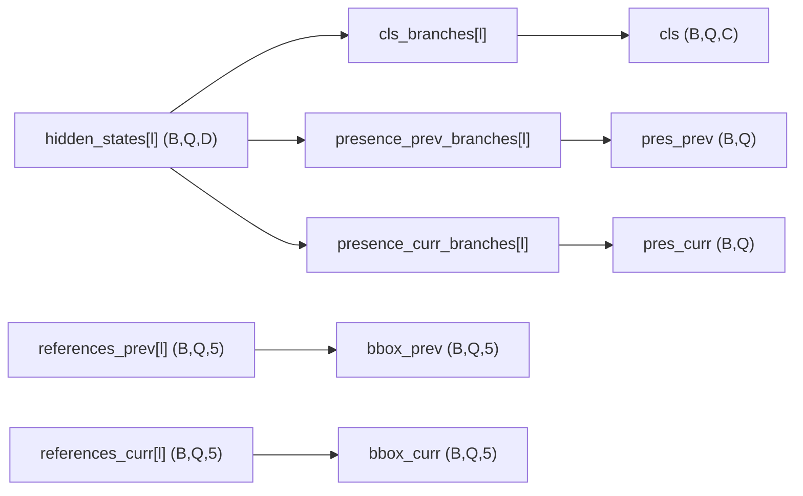

# M4 Pair Head / Assigner / Match Cost 修改报告

> **文档性质**：在 [m3_pair_decoder_report.md](./m3_pair_decoder_report.md)（M3j Pair Decoder）之后，**实施 M4：Pair Head、Hungarian Assigner 与 Match Cost**。  
> 本里程碑交付 **Head / Assigner / Cost 模块与单元测试**；接入 `MultispecPairRotatedRTDETR`、训练 config、DN 留待后续。

| 项 | 内容 |
|----|------|
| 里程碑 | M4 — `PairRotatedRTDETRHead` + `PairHungarianAssigner` + Pair Match Costs |
| 前置文档 | [m3_pair_decoder_report.md](./m3_pair_decoder_report.md)、[o2_rtdetr_audit_report.md](./o2_rtdetr_audit_report.md) §7 |
| 日期 | 2026-06-16 |
| 仓库 | `/data/users/litianhao01/PairMmot/ai4rs` |
| 原则 | **新增 pair head/assigner 文件，不修改原 O2-RTDETR 核心文件** |

---

## 1. 目标与范围

### 1.1 目标

1. 实现 `PairRotatedRTDETRHead`，输出 shared cls、prev/curr presence、prev/curr OBB。
2. 实现 `PairHungarianAssigner`：一个 Query 对一个完整 GT Pair，**单次** Hungarian。
3. 实现 Pair Match Costs：复用 O2 `FocalLossCost` / `ChamferCost` / `GDCost`，增加 prev/curr presence BCE cost；box cost 由 `valid_*` 门控。
4. Loss：未匹配 Query → 背景 cls + 双侧 presence=0；匹配 Query → shared cls + presence + **可见侧** box loss（`valid_mask` 屏蔽缺失帧）。
5. 支持全部 decoder auxiliary layer loss；**关闭** encoder auxiliary 与 denoising loss。
6. `predict` 输出 `PairInstanceData`，**不执行 NMS**。

### 1.2 与 M3j 的对应关系

| M3j 状态 | M4 交付 |
|---------|---------|
| Pair Decoder 产出 hidden + dual references | ✅ Head 消费 decoder 输出 |
| Pair Loss / valid mask | ✅ Assigner + Head loss 接入 `valid_prev/valid_curr` |
| Detector 端到端 `loss()` | ❌ 留待 M5 |
| 训练 config `hsmot_pair.py` | ❌ 留待 M5 |
| DN query | ❌ 留待 M5+ |

### 1.3 不在本里程碑范围

- 修改 `RotatedRTDETRHead` / `HungarianAssigner` 原文件
- `MultispecPairRotatedRTDETR.forward_transformer` / `loss()` 接入
- PairCdnQueryGenerator / denoising loss
- Encoder top-k auxiliary loss
- Tracker 推理与 ID 输出
- 端到端训练 Runner

---

## 2. 新增 / 修改文件清单

| 路径 | 类型 | 说明 |
|------|------|------|
| `projects/multispec_pair_rotated_rtdetr/.../pair_instance_data.py` | **新增** | `PairInstanceData` 预测容器 |
| `projects/multispec_pair_rotated_rtdetr/.../pair_match_cost.py` | **新增** | `PairChamferCost` / `PairGDCost` / `PairPresenceBCECost` |
| `projects/multispec_pair_rotated_rtdetr/.../pair_hungarian_assigner.py` | **新增** | `PairHungarianAssigner` |
| `projects/multispec_pair_rotated_rtdetr/.../pair_rotated_rtdetr_head.py` | **新增** | `PairRotatedRTDETRHead` |
| `projects/multispec_pair_rotated_rtdetr/.../__init__.py` | 修改 | 导出 M4 类 |
| `tests/test_projects/test_pair_rotated_rtdetr_head.py` | **新增** | M4 单元测试（11 项） |

### 2.1 未修改的文件

- `projects/rotated_rtdetr/rotated_rtdetr/rotated_rtdetr_head.py`
- `projects/rotated_dino/rotated_dino/match_cost.py`（Chamfer/GD 直接实例化复用）
- `projects/multispec_pair_rotated_rtdetr/.../multispec_pair_rotated_rtdetr.py`（M2 双路 decoder 逻辑不变）

---

## 3. 关键设计

### 3.1 类继承与组件关系

```
RotatedRTDETRHead
    └── PairRotatedRTDETRHead
            + presence_prev_branches / presence_curr_branches  # Linear(D→1) × num_layers
            + PairHungarianAssigner (train_cfg.assigner)

PairHungarianAssigner
    match_costs = [
        FocalLossCost,           # shared cls
        PairChamferCost(prev), PairChamferCost(curr),
        PairGDCost(prev), PairGDCost(curr),
        PairPresenceBCECost(prev), PairPresenceBCECost(curr),
    ]
```

### 3.2 Head 前向



OBB 直接来自 Pair Decoder 逐层更新的 sigmoid references（与 O2-RTDETR decoder 内 reg 路径一致），Head 不再重复 `reg_branches` 解码。

### 3.3 单次 Hungarian 匹配

- **Pred `InstanceData`**：`scores (Q,C)`、`bboxes_prev/curr (Q,5)` 反归一化、`presence_prev/curr (Q,)` logits。
- **GT `InstanceData`**：`labels (M,)`、`bboxes_prev/curr (M,5)`、`valid_prev/curr (M,)` bool。
- 各 cost 矩阵 `(Q, M)` 求和后 **一次** `linear_sum_assignment`。
- `PairSideBoxMatchCost`：内部调用原 `ChamferCost`/`GDCost`，对 `valid_*==False` 的 GT 列置零。

### 3.4 Loss 规则

| Query 状态 | loss_cls | loss_pres_prev/curr | loss_bbox/iou_prev/curr |
|-----------|----------|---------------------|-------------------------|
| 未匹配 | 背景类 | target=0 | weight=0 |
| 匹配 | GT label | target=valid_* | 仅 valid 侧 weight=1 |

- `loss_by_feat` 对所有 decoder 层 `multi_apply`；末层键名 `loss_*`，浅层 `d{i}.loss_*`。
- **不计算** `enc_loss_*`、`dn_loss_*`（参数传入亦忽略）。

### 3.5 Tensor 形状约定

设 decoder 层数 `L`，batch `B`，query `Q`，类别 `C`。

| Tensor | Shape | 说明 |
|--------|-------|------|
| `all_layers_cls_scores` | `(L, B, Q, C)` | shared class logits |
| `all_layers_presence_prev/curr` | `(L, B, Q)` | presence logits |
| `all_layers_bbox_prev/curr` | `(L, B, Q, 5)` | sigmoid OBB |
| GT `valid_prev/curr` | `(M,)` | 缺失帧 box loss 屏蔽依据 |
| `PairInstanceData.bboxes_*` | `(N, 5)` | predict 反归一化 OBB |

### 3.6 推荐 train_cfg.assigner 片段

```python
train_cfg=dict(
    assigner=dict(
        type='PairHungarianAssigner',
        match_costs=[
            dict(type='mmdet.FocalLossCost', weight=2.0),
            dict(type='PairChamferCost', side='prev', weight=5.0),
            dict(type='PairChamferCost', side='curr', weight=5.0),
            dict(type='PairGDCost', side='prev', loss_type='kld',
                 fun='log1p', tau=1, sqrt=False, weight=2.0),
            dict(type='PairGDCost', side='curr', loss_type='kld',
                 fun='log1p', tau=1, sqrt=False, weight=2.0),
            dict(type='PairPresenceBCECost', side='prev', weight=1.0),
            dict(type='PairPresenceBCECost', side='curr', weight=1.0),
        ]))
```

---

## 4. 测试结果

环境：`conda py310`，工作目录 `ai4rs/`。

### 4.1 单元测试

```bash
/data/users/litianhao01/anaconda3/envs/py310/bin/python -m pytest \
  tests/test_projects/test_pair_rotated_rtdetr_head.py -v
```

| 测试项 | 结果 | 验收点 |
|--------|------|--------|
| `test_exact_pair_priority_matching` | ✅ PASS | 精确框对 Query 优先匹配 |
| `test_swapped_curr_target_increases_cost` | ✅ PASS | 交换 curr GT 后代价升高 |
| `test_new_target_only_curr_box_loss` | ✅ PASS | 新生目标仅 curr box loss / 梯度 |
| `test_disappear_only_prev_box_loss` | ✅ PASS | 消失目标仅 prev box loss / 梯度 |
| `test_missing_box_no_gradient` | ✅ PASS | 缺失侧 box 无有效梯度 |
| `test_duplicate_predictions_single_match` | ✅ PASS | 重复预测仅一个 Query 匹配 |
| `test_forward_output_shapes` | ✅ PASS | 五路输出 shape |
| `test_aux_layer_loss_keys` | ✅ PASS | 辅助层 loss；无 enc/dn |
| `test_predict_returns_pair_instance_data` | ✅ PASS | predict → PairInstanceData |
| `test_static_import_from_package` | ✅ PASS | 包级静态导入 |
| `test_config_build_minimal_forward` | ✅ PASS | Decoder + Head 最小前向 |

**合计：11 passed**（2026-06-16，py310）。

### 4.2 最小前向

```bash
cd ai4rs && /data/users/litianhao01/anaconda3/envs/py310/bin/python -c "..."
# 输出: minimal forward ok [(1, 1, 3, 3), (1, 1, 3), (1, 1, 3), (1, 1, 3, 5), (1, 1, 3, 5)]
```

---

## 5. 验收对照

| 设计要求 | 状态 |
|----------|------|
| shared cls + dual presence + dual OBB 输出 | ✅ |
| Query ↔ 完整 GT Pair 单次 Hungarian | ✅ |
| box cost 按 valid mask 门控 | ✅ |
| 复用 Focal/Chamfer/GD + 角度表示 | ✅ |
| 两个 presence BCE cost | ✅ |
| 未匹配 → 背景 + presence=0 | ✅ |
| 匹配 → cls + presence + 可见侧 box loss | ✅ |
| decoder 全层 auxiliary loss | ✅ |
| 关闭 enc / DN loss | ✅ |
| predict → PairInstanceData，无 NMS | ✅ |
| 不修改原 O2-RTDETR 文件 | ✅ |
| 6 项匹配/loss 测试 + 静态导入 + 最小前向 | ✅ |

---

## 6. 仍未完成的事项（M5+）

1. **Detector 接入**：`MultispecPairRotatedRTDETR` 用 Pair Decoder + Pair Head 替换 M2 双路独立 decoder/head；实现 `loss()` / `predict()` 数据流（`pair_gt_instances` → head）。
2. **`pre_decoder` Top-K**：替换 M3j learned query / dual references。
3. **Denoising**：`PairCdnQueryGenerator` 与 DN loss（M4 已预留关闭逻辑）。
4. **Encoder auxiliary loss**：如需与 O2 对齐，在 detector 层按需重新打开。
5. **训练 config**：`hsmot_pair.py` 注册 `PairRotatedRTDETRHead` + `PairHungarianAssigner`。
6. **Tracker / 推理后处理**：基于 `PairInstanceData` 的跨帧 ID 关联。
7. **M2/M3 等价性回归**：`(I,I)` 输入下 pair 行为与单帧对齐测试。

---

## 7. 修订记录

| 日期 | 说明 |
|------|------|
| 2026-06-16 | M4 Pair Head / Assigner / Match Cost 初版完成报告 |
