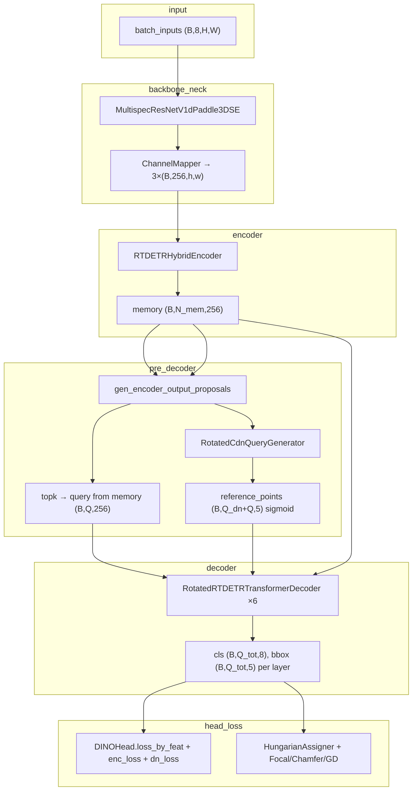
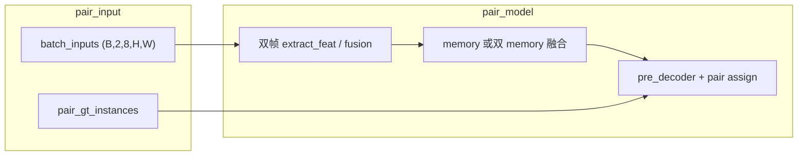

# O2-RTDETR 代码审计报告（只读，M1 实施前）

> **文档性质**：在 **未修改任何仓库文件** 的前提下，对现有 O2-RTDETR / RotatedDINO 栈做的只读代码审计。  
> **审计环境**：**py310** 下可读到的 mmdet 父类（`mmdet/models/detectors/`、`dense_heads/`）与仓库内 `rotated_rtdetr` / `rotated_dino` 源码。  
> **审计时训练配置**：`o2_rtdetr_r50vd_2xb4_72e_hsmot_coco_pretrain.py`（继承 `o2_rtdetr_r50vd_2xb4_72e_hsmot.py`）。  
> **与 M1 的关系**：本报告描述审计当时仓库状态；Pair 数据管线等后续改动见 [m1_pair_data_pipeline_report.md](./m1_pair_data_pipeline_report.md)。


| 项                    | 路径                                                                                          |
| -------------------- | ------------------------------------------------------------------------------------------- |
| 审计日期                 | 2026-06-16                                                                                  |
| 审计方式                 | 只读分析，**未改代码**                                                                               |
| 仓库根目录                | `/data/users/litianhao01/PairMmot/ai4rs`                                                    |
| py310 mmdet          | `/data/users/litianhao01/anaconda3/envs/py310/lib/python3.10/site-packages/mmdet`           |
| 当前 HSMOT 配置          | `projects/multispec_rotated_rtdetr/configs/o2_rtdetr_r50vd_2xb4_72e_hsmot_coco_pretrain.py` |
| 配置基类                 | `projects/multispec_rotated_rtdetr/configs/o2_rtdetr_r50vd_2xb4_72e_hsmot.py`               |
| RotatedRTDETR        | `projects/rotated_rtdetr/rotated_rtdetr/rotated_rtdetr.py`                                  |
| RotatedRTDETRHead    | `projects/rotated_rtdetr/rotated_rtdetr/rotated_rtdetr_head.py`                             |
| RotatedRTDETRDecoder | `projects/rotated_rtdetr/rotated_rtdetr/rotated_rtdetr_layers.py`                           |
| RotatedDINO          | `projects/rotated_dino/rotated_dino/rotated_dino.py`                                        |
| RotatedDINOHead      | `projects/rotated_dino/rotated_dino/rotated_dino_head.py`                                   |
| Match Cost           | `projects/rotated_dino/rotated_dino/match_cost.py`                                          |


---

## 1. 继承关系（MRO）

```
RotatedRTDETR → RotatedDINO → DINO → RotatedDeformableDETR → DeformableDETR → DetectionTransformer → BaseDetector
```

**Head：**

```
RotatedRTDETRHead → RotatedDINOHead → DINOHead → RotatedDeformableDETRHead → DeformableDETRHead → RotatedDETRHead → DETRHead
```

**Decoder：**

```
RotatedRTDETRTransformerDecoder → RotatedDinoTransformerDecoder → DinoTransformerDecoder → …
```

---

## 2. 完整调用链

### 2.1 `loss`

```
BaseDetector.loss (mmengine)
  └─ RotatedRTDETR (无 override)
      └─ DetectionTransformer.loss
          ├─ extract_feat(batch_inputs)          # (B,C,H,W) → neck 多尺度特征
          ├─ forward_transformer(img_feats, batch_data_samples)
          │     └─ DINO.forward_transformer (RotatedDINO 未 override)
          │         ├─ pre_transformer          → RotatedRTDETR.pre_transformer
          │         ├─ forward_encoder          → RotatedRTDETR.forward_encoder
          │         ├─ pre_decoder              → RotatedRTDETR.pre_decoder
          │         └─ forward_decoder          → DINO.forward_decoder
          └─ bbox_head.loss(**head_inputs_dict, batch_data_samples)
              └─ DINOHead.loss → RotatedRTDETRHead.forward (透传 decoder 输出)
                  └─ DINOHead.loss_by_feat
                      ├─ DETRHead.loss_by_feat (matching queries, 各 decoder 层)
                      ├─ enc_loss (top-k encoder proposals)
                      └─ dn_loss (RotatedRTDETRHead._loss_dn_single, Varifocal+5D box)
```

### 2.2 `predict`

```
DetectionTransformer.predict
  ├─ extract_feat
  ├─ forward_transformer (同上，eval 无 DN)
  └─ bbox_head.predict
      └─ DeformableDETRHead.predict → predict_by_feat (取最后一层)
          └─ RotatedDETRHead._predict_by_feat_single
              └─ RotatedRTDETRHead._predict_by_feat_single (+ batched_nms)
```

### 2.3 `_forward`（无后处理）

```
DetectionTransformer._forward
  ├─ forward_transformer
  └─ bbox_head.forward → RotatedRTDETRHead.forward (直接返回 decoder 的 cls/coord 列表)
```

### 2.4 `forward_transformer` 四阶段


| 阶段                | 实现类                    | 关键输出                                                             |
| ----------------- | ---------------------- | ---------------------------------------------------------------- |
| `pre_transformer` | `RotatedRTDETR`        | `spatial_shapes (L,2)`, `level_start_index`, `valid_ratios=None` |
| `forward_encoder` | `RotatedRTDETR`        | `RTDETRHybridEncoder` + flatten → `memory`                       |
| `pre_decoder`     | `RotatedRTDETR`        | Top-K query、`reference_points`、DN query/mask                     |
| `forward_decoder` | `DINO.forward_decoder` | 调用 `RotatedRTDETRTransformerDecoder`                             |


---

## 3. 各阶段 Tensor Shape（以当前 HSMOT 配置为基准）

**符号**：`B=4`（batch）、`Q=300`（matching queries）、`D=256`、`L=3` 特征层、`C_cls=8`、`C_in=8`（8 通道）。

输入经 `Resize(800,1200)` + `pad_size_divisor=32`，记 padded 尺寸为 `H×W`（约 800×1216 量级，随 keep_ratio 变化）。


| 阶段                                    | Tensor                    | Shape                                                          | 说明                             |
| ------------------------------------- | ------------------------- | -------------------------------------------------------------- | ------------------------------ |
| 输入                                    | `batch_inputs`            | `(B, 8, H, W)`                                                 | `MultispecDetDataPreprocessor` |
| Neck 输出                               | `mlvl_feats[i]`           | `(B, 256, H/8, W/8)`, `(B,256,H/16,W/16)`, `(B,256,H/32,W/32)` | stride 8/16/32                 |
| Encoder 输入                            | 同上 3 层                    | 经 `RTDETRHybridEncoder`（FPN + 最后一层 1× TransformerEncoder）      |                                |
| `memory`                              | `(B, N_mem, D)`           | `N_mem = Σ(h_i×w_i)`，约 1.5万～2万点                                |                                |
| `output_memory`                       | `(B, N_mem, D)`           | encoder proposal 分支                                            |                                |
| `output_proposals`                    | `(B, N_mem, 5)`           | inverse_sigmoid 空间，(cx,cy,w,h,angle)                           |                                |
| `enc_outputs_class`                   | `(B, N_mem, 8)`           | 用 `cls_branches[6]`                                            |                                |
| **Top-K**                             | `topk_indices`            | `(B, Q)`                                                       | 见 §4                           |
| `query` (train)                       | `(B, Q_dn+Q, D)`          | DN + Top-K memory gather                                       |                                |
| `reference_points`                    | `(B, Q_dn+Q, 5)`          | sigmoid 后                                                      |                                |
| `dn_mask`                             | `(Q_total, Q_total)`      | self-attn mask                                                 |                                |
| Decoder 每层 `query`                    | `(B, Q_total, D)`         | RT-DETR 在 decoder 内算 head                                      |                                |
| `reference_points_input` (cross-attn) | `(B, Q_total, L, 5)`      | angle 维 × `angle_factor`                                       |                                |
| 每层 cls                                | `(B, Q_total, 8)`         | `cls_branches[lid](query)`                                     |                                |
| 每层 bbox                               | `(B, Q_total, 5)`         | sigmoid(cxcywha)                                               |                                |
| `enc_outputs` (loss)                  | `(B, Q, 8)` / `(B, Q, 5)` | 仅 top-k 子集                                                     |                                |


**推理**：`Q_total=Q=300`，decoder 只跑到 `eval_idx`（默认 -1 → 第 6 层，即最后一层），输出 **1 层** cls/bbox。

**训练 DN 规模**（动态分组）：

- `num_groups = max(1, num_dn_queries // max_num_gt)`，`num_dn_queries=100`
- `Q_dn = max_num_gt × 2 × num_groups`（上限约 100×2=200 量级，随 GT 数变化）

---

## 4. Top-K Query 生成位置

**唯一入口**：`RotatedRTDETR.pre_decoder`（覆盖 `RotatedDINO` / `DINO`）。

流程：

1. `gen_encoder_output_proposals` → `output_memory`, `output_proposals (B,N_mem,5)`
2. `cls_branches[num_layers](output_memory)` → `enc_outputs_class`
3. `topk_indices = topk(enc_outputs_class.max(-1)[0], k=num_queries, dim=1)`
4. `query = gather(output_memory, topk_indices)` — **内容 query 来自 encoder memory，不是 `query_embedding`**
5. `topk_coords_unact = reg_branches[num_layers](query) + gather(output_proposals, topk_indices)`

与 `RotatedDINO.pre_decoder` 的差异：DINO 用 `query_embedding` + gather coord；RT-DETR **gather memory 作为 query**，reg 在 gather 后的 query 上算 offset。

---

## 5. `reference_points`：编码、更新、detach


| 位置                        | 操作                                                                                                              |
| ------------------------- | --------------------------------------------------------------------------------------------------------------- |
| **Proposal 初始化**          | `gen_proposals` / `gen_encoder_output_proposals`：网格 (cx,cy,w,h) + angle=0.5 → `inverse_sigmoid`                 |
| **pre_decoder (train)**   | `topk_coords_unact.detach()`；`query.detach()`；DN bbox 与 topk unact 拼接 → **整体 `.sigmoid()`** 送入 decoder          |
| **pre_decoder (eval)**    | `reference_points = topk_coords_unact`（未 detach）→ `.sigmoid()`                                                  |
| **Decoder 内 query 位置编码**  | `RotatedRTDETRTransformerDecoder`：`ref_point_head(MLP(5→D))` 作用于 **sigmoid 后的 5D ref**（非 DINO 的 sine encoding）  |
| **Cross-attn 采样**         | `reference_points_input[..., -1] *= angle_factor`；`RotatedMultiScaleDeformableAttention` 5D 旋转采样                |
| **每层更新 (train)**          | `tmp = reg_branches[lid](query)`；`unact = tmp + inverse_sigmoid(ref).detach()`；`ref = unact.sigmoid().detach()` |
| **每层更新 (eval)**           | 同上，但只执行到 `eval_idx` 层                                                                                           |
| **Head (RotatedDINO 路径)** | `RotatedDINOHead.forward` 会对 `references[layer]` 做 `inverse_sigmoid` 再加 reg — **RT-DETR Head 不走这条路径**           |


要点：RT-DETR 在 decoder 内完成 bbox 预测；ref 更新链路上 **inverse_sigmoid(ref) 与更新后的 ref 均 detach**，阻断梯度经 ref 回传。

---

## 6. Classification / Regression / Angle 分支创建位置

**无独立 `angle_branches`**。五维旋转框由 **同一个 `reg_branches`** 输出（`reg_dim=5`）。

创建链：

```
DeformableDETR.__init__
  → bbox_head['num_pred_layer'] = decoder.num_layers + 1  # 6+1=7
  → bbox_head['share_pred_layer'] = not with_box_refine  # False（每层独立）

RotatedDeformableDETRHead._init_layers
  → cls_branches: ModuleList[7]  # Linear(D, num_classes)=Linear(256,8)
  → reg_branches: ModuleList[7]  # MLP → Linear(D, reg_dim)=Linear(256,5)
```

使用位置：


| 索引                       | 用途                                                          |
| ------------------------ | ----------------------------------------------------------- |
| `cls/reg_branches[0..5]` | Decoder 6 层，在 `RotatedRTDETRTransformerDecoder.forward` 内调用 |
| `cls/reg_branches[6]`    | `pre_decoder` 中 encoder top-k 评分与 coord 预测                  |


Angle 在 `reg_branches` 第 5 维；`RotatedDeformableDETRHead.forward` 里仅 `tmp_reg_preds[..., :4] += reference[..., :4]`（DINO/DeformDETR head 路径），但 RT-DETR decoder 内对 **完整 5 维** 做 `tmp + inverse_sigmoid(ref)`。

---

## 7. Hungarian Assigner、Match Cost、DN Query

### 7.1 Matching（`train_cfg.assigner`）

```python
HungarianAssigner(
  match_costs=[
    FocalLossCost(weight=2.0),
    ChamferCost(weight=5.0, box_format='xywha'),  # projects/rotated_dino/match_cost.py
    GDCost(loss_type='kld', fun='log1p', tau=1, sqrt=False, weight=2.0),
  ])
```

- **Assigner 类**：`mmdet.models.task_modules.HungarianAssigner`
- **分类代价**：`FocalLossCost`（mmdet）
- **回归代价**：`ChamferCost`（角点 Chamfer，归一化 cxcywha）
- **旋转几何代价**：`GDCost`（KLD on Gaussian，`xy_wh_r` 表示）

调用点：`RotatedDETRHead._get_targets_single` → `self.assigner.assign(pred_instances, gt_instances, img_meta)`（unnormalized 5D rbox）。

### 7.2 DN Query（`dn_cfg`）


| 项                   | 值                                                                           |
| ------------------- | --------------------------------------------------------------------------- |
| **类**               | `RotatedCdnQueryGenerator`（`rotated_dino_layers.py`，继承 `CdnQueryGenerator`） |
| **实例化**             | `RotatedDINO.__init__`（非 mmdet `CdnQueryGenerator`）                         |
| `label_noise_scale` | 0.5                                                                         |
| `box_noise_scale`   | 1.0                                                                         |
| `noise_mode`        | `'only_xyxy'`（在 xyxy 空间加噪再转 cxcywh，angle 不加噪）                               |
| `group_cfg`         | `dynamic=True`, `num_dn_queries=100`                                        |
| `angle_cfg`         | `width_longer=True`, `start_angle=0`                                        |
| `angle_factor`      | π                                                                           |


输出：`dn_label_query (B,Q_dn,D)`、`dn_bbox_query (B,Q_dn,5)` inverse_sigmoid 空间、`attn_mask`、`dn_meta`。

DN target：`RotatedDINOHead._get_dn_targets_single`（5D 归一化 bbox，无 Hungarian）。

---

## 8. 当前配置要点（`o2_rtdetr_r50vd_2xb4_72e_hsmot` + coco pretrain）

- **Detector**：`RotatedRTDETR`, `num_queries=300`, `as_two_stage=True`, `with_box_refine=True`
- **Backbone**：`MultispecResNetV1dPaddle3DSE`, `in_channels=8`（与 rotated_rtdetr 核心逻辑解耦）
- **Encoder**：`RTDETRHybridEncoder`, `use_encoder_idx=[-1]`, 1 层 Transformer on P5
- **Decoder**：6 层, `angle_factor=π`, `return_intermediate=True`
- **Loss_cls**：`RTDETRVarifocalLoss`, `varifocal_loss_iou_type='hbox_iou'`（DN/matching 均可用 prob/rbox iou）
- **Loss_bbox**：`L1Loss` weight 5.0；**Loss_iou**：`GDLoss(kld)` weight 2.0
- **Pretrain 子配置**：仅覆盖 `model.backbone.init_cfg` → COCO RT-DETR R50 backbone

---

## 9. 实现 Pair 版本：最少需要 override 的方法

假设 Pair = **双帧输入 + 联合检测/关联**（PairMmot 方向），在现有栈上 **最少** 应覆盖：


| 组件                   | 方法                                               | 原因                                   |
| -------------------- | ------------------------------------------------ | ------------------------------------ |
| **Detector**         | `extract_feat` 或 `forward_encoder`               | 双帧特征提取/融合，单帧 `memory` 不够             |
| **Detector**         | `pre_decoder`（很可能）                               | Top-K query 来源、query 数量、是否 per-frame |
| **Detector**         | `forward_decoder`（可选）                            | 若需传入 pair 特有 kwargs（如 fusion state）  |
| **Detector**         | `pre_transformer`（若双帧尺寸/level 不一致）               | 当前假设单图多尺度                            |
| **DataPreprocessor** | `forward`                                        | 接受 `(B,2,8,H,W)` 并规范为 backbone 输入    |
| **Head**             | `loss` / `loss_by_feat` 或 `_get_targets_single`  | Pair 匹配、track_id 监督、跨帧 assign        |
| **Head**             | `predict` / `_predict_by_feat_single`（若输出 track） | 关联 ID 或 pair 后处理                     |
| **DN**               | `RotatedCdnQueryGenerator.__call_`_ 或子类          | 双帧 GT 对齐、跨帧 DN mask                  |
| **Decoder**（仅当改交互）   | `RotatedRTDETRTransformerDecoder.forward`        | 跨帧 cross-attn / query 交互             |


**通常不必 override**：`DetectionTransformer.loss/predict` 外壳、`RotatedRTDETRHead.forward`（若仍由 decoder 产出 cls/bbox）、`gen_proposals`（单帧几何先验可复用）。

---

## 10. 不能直接复用的组件


| 组件                                                 | 原因                                                   |
| -------------------------------------------------- | ---------------------------------------------------- |
| `MultispecResNetV1dPaddle3DSE` + 单图 `extract_feat` | 设计为单张 8 通道图，非显式双帧时序/配对结构                             |
| `MultispecDetDataPreprocessor`                     | 当前假设 `(B,8,H,W)`，非 `(B,2,8,H,W)`                     |
| `RotatedRTDETR.pre_decoder`                        | Top-K / query gather 假设 **单帧 memory**                |
| `RotatedCdnQueryGenerator`                         | 单 `batch_data_samples`、单帧 GT、DN mask 无 track/pair 语义 |
| `HungarianAssigner` + 现有 `match_costs`             | 逐图一对一匹配，无 cross-frame / track consistency            |
| 单帧 `HSMOTDataset` pipeline                         | 单帧 `PackDetInputs`，`with_track_id=False`             |
| `RotatedRTDETRHead._predict_by_feat_single`        | 单帧检测 + NMS，无 track 输出                                |
| `pre_transformer`（DeformableDETR 版）                | RT-DETR 已简化，但仍假设 **一批单图** 的 `batch_data_samples`     |
| 推理 `eval_idx` 早停逻辑                                 | 仅单帧一层输出，无 pair 融合决策                                  |


**可较大程度复用**：`reg_branches` / `cls_branches` 结构、`RotatedRTDETRTransformerDecoder` 层内逻辑（若 memory 已融合）、`GDCost`/`ChamferCost`、`VarifocalLoss`、`RTDETRHybridEncoder`（每帧各跑或共享权重）、`rotated_attention` 5D 可变形注意力。

---

## 11. 建议新文件列表（规划，审计时尚未创建）

```
projects/pair_rotated_rtdetr/
├── pair_rotated_rtdetr/
│   ├── __init__.py
│   ├── pair_rotated_rtdetr.py          # PairRotatedRTDETR：双帧 extract_feat / encoder 融合
│   ├── pair_rotated_rtdetr_head.py     # Pair 监督、跨帧 assign、track 预测
│   ├── pair_cdn_query_generator.py     # 双帧 DN + pair-aware attn_mask
│   ├── pair_match_cost.py              # 可选：跨帧 Chamfer/GD/track consistency cost
│   ├── pair_fusion.py                  # 可选：memory/query 级 fusion（concat/attn）
│   └── pair_assigner.py                # 可选：Hungarian 扩展或两阶段 match
├── configs/
│   ├── pair_o2_rtdetr_r50vd_2xb4_72e_hsmot.py
│   └── hsmot_pair.py                   # pair dataloader、track_id、双帧采样
└── README.md
```

若与 multispec 叠加，可放在 `projects/multispec_pair_rotated_rtdetr/`，仅新增 `pair_*.py`，backbone 继续用 `MultispecResNetV1dPaddle3DSE`。

审计时 **数据侧** 仅有单帧 `HSMOTDataset` + `PackDetInputs`；Pair 数据管线（`HSMOTPairDataset` 等）为 §9–§11 中的规划项，在 M1 中才落地，详见 [m1_pair_data_pipeline_report.md](./m1_pair_data_pipeline_report.md)。

## 12. 架构流程图（训练）




**Pair 目标扩展（审计时仅为规划，模型与数据均未实现）**：




---

## 13. mmdet 父类关键文件索引（py310）


| 类 / 方法                              | mmdet 路径                                               |
| ----------------------------------- | ------------------------------------------------------ |
| `DetectionTransformer.loss/predict` | `models/detectors/base_detr.py`                        |
| `DeformableDETR`                    | `models/detectors/deformable_detr.py`                  |
| `DINO`                              | `models/detectors/dino.py`                             |
| `DINOHead.loss_by_feat`             | `models/dense_heads/dino_head.py`                      |
| `DeformableDETRHead`                | `models/dense_heads/deformable_detr_head.py`           |
| `HungarianAssigner`                 | `models/task_modules/assigners/hungarian_assigner.py`  |
| `FocalLossCost`                     | `models/task_modules/coders/match_costs/match_cost.py` |
| `CdnQueryGenerator`                 | `models/layers/transformer/dino_layers.py`             |


---

## 14. 修订记录


| 日期         | 说明                                                                |
| ---------- | ----------------------------------------------------------------- |
| 2026-06-16 | 只读审计初版归档；明确为 M1 实施前快照，不含 Pair 数据管线改动                              |
| 2026-06-16 | 与 M1 报告拆分：移除「已实现 Pair 管线」表述，改指向 `m1_pair_data_pipeline_report.md` |


---

如需针对「Pair」的精确定义（双帧时序 / RGB-IR 配对 / query 级 association）做更细的 override 矩阵，可在 M1 数据管线就绪后结合 [m1_pair_data_pipeline_report.md](./m1_pair_data_pipeline_report.md) 收敛 §9–§11 的改动面。