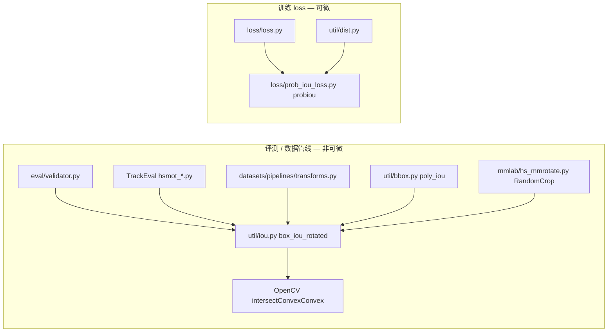

# hsmot 去 mmcv 轻量化与代码规范化 — 改动报告（第二轮）

> 生成日期：2026-06-09  
> 环境：conda `py310`  
> 范围：`hsmot/` 包 + `TrackEval/` 中 3 个 hsmot 数据集适配器

---

## 1. 本轮需求与结论

| 需求 | 处理方式 | 状态 |
|------|----------|------|
| ProbIoU 仅替换可微 IoU，评测仍用几何 IoU | 拆分 `box_iou_rotated`（几何）与 `probiou`（可微）职责 | ✅ 完成 |
| 补充不完整注释 | 补全 `bbox.py`、`dist.py`、`loss.py`、`load_checkpoint/` 等模块文档 | ✅ 完成 |
| 检查并规范文件夹结构 | 补齐 `__init__.py`、修正拼写、迁移实验代码 | ✅ 完成 |

**验证**：`pytest` 20/20 通过，`ruff check` 通过。

---

## 2. IoU 双路径架构（核心变更）

### 2.1 问题回顾

上一轮改造将 **所有** IoU 统一为 ProbIoU，导致评测 / TrackEval 匹配阈值与历史几何 IoU 基线不可对比。

### 2.2 本轮分工



| 场景 | API | 算法 | 可微 |
|------|-----|------|------|
| 评测 mAP、TrackEval 匹配 | `hsmot.util.iou.box_iou_rotated` | OpenCV 凸多边形几何 IoU/IoF | 否 |
| 训练 loss、归一化框相似度 | `hsmot.loss.prob_iou_loss.probiou` | ProbIoU（论文 2106.06072） | 是 |
| RandomCrop / poly_iou 过滤 | `box_iou_rotated` | 几何 IoU（与 mmcv 语义一致） | 否 |

### 2.3 `box_iou_rotated` 实现要点

- 文件：`hsmot/util/iou.py`
- 输入：`(N, 5)` xywhr，`angle` 为弧度
- `mode`：`iou` / `iof`（与 mmcv 一致）
- `clockwise`：与 mmcv 参数语义一致（`False` 时对角度取反）
- 实现：`box2corners` + `cv2.intersectConvexConvex` + `cv2.contourArea`
- **不依赖 mmcv**，仅依赖已有 `opencv-python`

### 2.4 调用方（无需改 import，行为已纠正）

以下模块继续 `from hsmot.util.iou import box_iou_rotated`，现自动获得几何 IoU：

- `hsmot/eval/validator.py`
- `hsmot/util/bbox.py`
- `hsmot/datasets/pipelines/transforms.py`
- `hsmot/mmlab/hs_mmrotate.py`
- `TrackEval/trackeval/datasets/hsmot_rgb.py`
- `TrackEval/trackeval/datasets/hsmot_8ch.py`
- `TrackEval/trackeval/datasets/hsmot_8ch_occ.py`

训练路径保持不变，直接使用 ProbIoU：

- `hsmot/loss/loss.py` → `loss_rotated_iou_norm_bboxes1` → `probiou`
- `hsmot/util/dist.py` → `box_iou_rotated_norm_bboxes1` → `probiou` / `batch_probiou`

### 2.5 实验性可微几何 IoU

- 原 `util/diff_iou_rotated_util.py` 迁至 `util/experimental/diff_iou_rotated_util.py`
- 未纳入主路径；文档说明与 ProbIoU / 几何 IoU 的分工

---

## 3. 注释补充

| 文件 | 补充内容 |
|------|----------|
| `util/iou.py` | 模块级说明、角度约定、`box_iou_rotated` 完整 docstring |
| `util/bbox.py` | `poly2obb_np_woscore`、`obb2poly_np_woscore`、`poly_iou` 参数与返回值 |
| `util/dist.py` | `box_iou_rotated_norm_bboxes1` 训练/评测分工说明 |
| `loss/loss.py` | `use_probiou` 语义澄清 |
| `load_checkpoint/load_multi_channel_pt.py` | 函数用途、参数说明 |
| `util/experimental/diff_iou_rotated_util.py` | 实验性质与三路径分工 |
| `test/test_opencv_speed.py` | 模块 docstring（手动 benchmark，非 pytest） |

---

## 4. 目录结构规范化

### 4.1 改造前问题

| 问题 | 说明 |
|------|------|
| 缺少 `__init__.py` | `datasets/`、`pipelines/`、`mmlab/`、`eval/`、`modules/`、`load_checkpoint/` 未声明为包 |
| 拼写错误 | `test/test_opnecv_speed.py` |
| 实验代码位置不当 | `diff_iou_rotated_util.py` 与生产 `util/` 混放 |

### 4.2 改造后结构

```
hsmot/
├── __init__.py
├── datasets/
│   ├── __init__.py          # 新增
│   └── pipelines/
│       ├── __init__.py      # 新增
│       ├── channel.py
│       ├── compose.py
│       ├── formatting.py
│       ├── loading.py
│       └── transforms.py
├── eval/
│   ├── __init__.py          # 新增
│   ├── validator.py
│   └── vt_tiny_coco.py
├── loss/
│   ├── __init__.py
│   ├── loss.py
│   └── prob_iou_loss.py
├── load_checkpoint/
│   ├── __init__.py          # 新增
│   └── load_multi_channel_pt.py
├── mmlab/
│   ├── __init__.py          # 新增（导出 hs_mmcv）
│   ├── hs_mmcv.py
│   ├── hs_mmdet.py
│   ├── hs_mmrotate.py
│   └── hs_rectmot.py
├── modules/
│   ├── __init__.py          # 新增
│   └── conv.py
└── util/
    ├── __init__.py
    ├── bbox.py
    ├── dist.py
    ├── iou.py               # 几何 IoU（重写）
    ├── typing_utils.py
    └── experimental/        # 新增
        ├── __init__.py
        └── diff_iou_rotated_util.py
test/
├── test_iou.py              # 几何 IoU 测试（重写）
├── test_probiou.py          # 新增：ProbIoU 测试
├── test_opencv_speed.py     # 重命名（原 opnecv）
└── ...
```

### 4.3 命名约定说明

| 目录/前缀 | 含义 |
|-----------|------|
| `mmlab/` | OpenMMLab API 兼容 vendored 层，非 pip 依赖 |
| `hs_*` 前缀 | hsmot 定制版（如 `hs_mmcv` 替代 mmcv 图像 API） |
| `util/` | 通用工具（几何 IoU、距离、bbox 转换） |
| `loss/` | 训练损失与可微 ProbIoU |
| `util/experimental/` | 未验证实验代码，默认不 import |

---

## 5. 测试变更

| 测试文件 | 内容 | 结果 |
|----------|------|------|
| `test_iou.py` | 几何 IoU：相同框=1、不相交=0、iof、批形状 | 7 passed |
| `test_probiou.py` | ProbIoU：尺度不变性、角度敏感性等 | 5 passed |
| `test_dist.py` | 旋转 L1 距离 | 3 passed |
| `test_no_mmcv_import.py` | 无 mmcv/mmengine | 2 passed |
| `test_datasets.py` | MOT pipeline 集成 | 1 passed |
| `test_hs_mmcv.py` | 图像 I/O | 2 passed |

**合计：20 passed**（py310）

```bash
conda activate py310
cd hsmot
PYTHONPATH=. pytest test/ -v
```

---

## 6. 关键 API 速查

```python
# 评测 / 数据过滤 — 几何 IoU（非可微，mmcv 语义）
from hsmot.util.iou import box_iou_rotated

# 训练 loss — 可微 ProbIoU
from hsmot.loss.prob_iou_loss import probiou, batch_probiou, probiou_loss

# 图像工具 — 替代 mmcv 图像 API
from hsmot.mmlab import hs_mmcv
```

---

## 7. 风险与后续建议

| 项 | 说明 |
|----|------|
| 几何 IoU 性能 | OpenCV 逐对循环，大批量 N×M 评测可能较慢；可按需加 Numba/C++ 扩展 |
| ProbIoU vs 几何 IoU 数值差 | 训练 loss 与评测指标仍可能不一致，属预期行为 |
| vendored 大文件 | `hs_mmdet.py`、`hs_mmrotate.py`、`channel.py` 仍排除 ruff，可后续拆分 |
| `convex_giou` | 未实现，调用抛 `NotImplementedError` |

---

## 8. 改动摘要

本轮在上一轮去 mmcv 基础上完成三项收敛：

1. **IoU 职责分离**：`box_iou_rotated` 恢复几何 IoU（评测可比），ProbIoU 仅用于训练可微路径
2. **注释补全**：核心工具与 checkpoint 加载模块文档完善
3. **结构规范**：补齐包 `__init__.py`、修正测试文件拼写、实验代码迁入 `util/experimental/`

**当前状态**：无 mmcv 依赖，`pytest` 20/20，`ruff check` 通过，评测链路恢复几何 IoU 语义。
